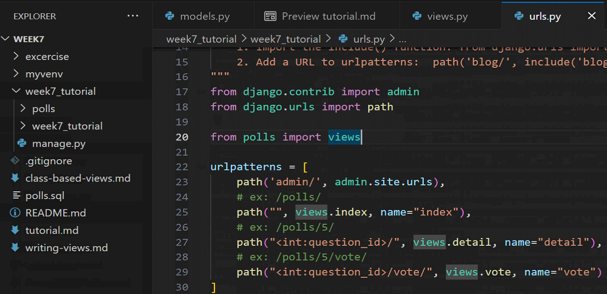
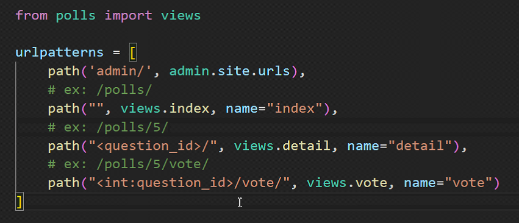
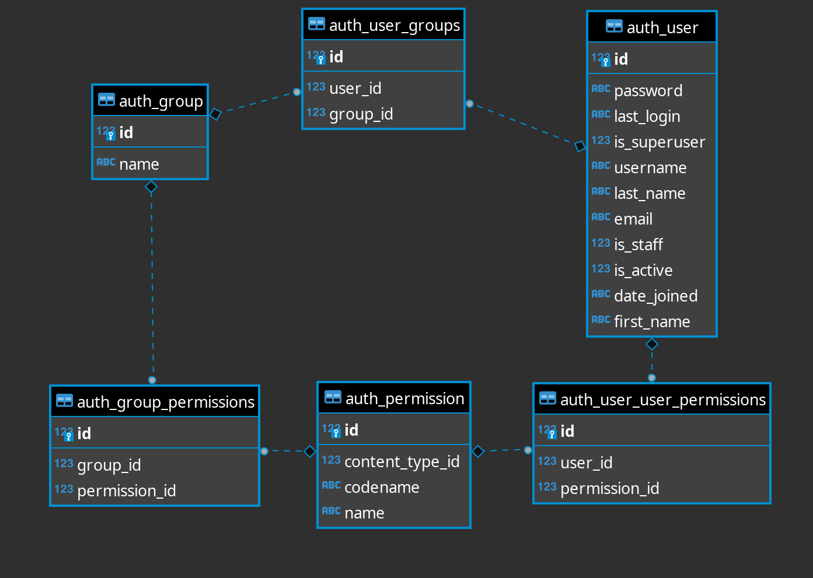

https://github.com/it-web-pro/
# รหัส: password


# Week 2
## WINDOW Install virtualenv
```bash
pip install virtualenv
```

Create a virtual environment
```bash
py -m venv myvenv
```

Activate virtual environment
```bash
myvenv\Scripts\activate.bat
```
---
## MacOS Install virtualenv
```bash
pip install virtualenv
```

Create a virtual environment
```bash
python -m venv myvenv
```

Activate virtual environment
```bash
source myvenv/bin/activate
```

```bash
django-admin startproject mysite
```
```python
mysite/
    manage.py
    mysite/
        __init__.py
        settings.py # สำหรับตั้งค่า project
        urls.py # สำหรับกำหนด path url
        asgi.py
        wsgi.py
```
Run server
```
py manage.py runserver <port>
```

## Start app
```bash
py manage.py startapp <app>
```
## คำสั่งในการเข้า Shell ใน Postgres
```sh
psql -U postgres
```
## คำสั่งในการแก้ไข Database
คำสั่งต้องทำคู่กันเมื่อมีการแก้ไข models.py
```bash
python manage.py makemigrations <Optional app>
```
ใช้เมื่อมีการแก้ไขไฟล์ models.py

```bash
python manage.py migrate <Optional app> <Optional number of migrations>
```

ใช้เพื่อให้ระบบนำไปอัพเดทข้อมูลในฐานข้อมูล ถ้ามีการแก้ไข Models

## คำสั่งภายใน Shell Django
```bash
<Table>.objects.all()
```
```bash
<Table>.objects.first()
```
```python
<Table>.objects.get(pk=)
<Table>.objects.get(id=)
# pk คือ ID
```
```python
.save()
# ใช้เมื่อต้องการบันทึกข้อมูลลงฐานข้อมูล
```

```python
.<Table>_set.count()
# ใช้เมื่อ Tables นั้นมีความสัมพันธ์ 1-M โดย Table เป็น 1 (เช่น choice_set)
```
```bash
<Table>.objects.filter(question_text__icontains="llo")
```
```python
<Table>.objects.filter(question_text__startswith="What")
# แสดงข้อมูลที่มีการกำหนดประโยคภายใน
```
```python
<Table>.objects.filter(<Table_FK>_id=1, ...)
# แสดงข้อมูลตาม ID โดยมี _id โดยต้องมี Foreign Key
```
```python
print(<คำสั่งที่เรียกข้อมูล>.query)
# แสดง SQL Query ที่คำสั่งใช้ใน Database
```
```python
<Table>.objects.all().delete()
# ลบข้อมูลทั้งหมดใน Table
```
`` command เป็นโค้ด Python

ถ้าเพิ่ม Template แล้วเข้าไปไม่ได้ให้รัน python manage.py runserver ใหม่

## Raise Http404
```py
try:
    ...
except <Model.class>.DoesNotExist:
    raise Http404("There are no question %d"%question_id)
```

## Add django-extensions for notebook .ipynb
```bash
pip install django-extensions ipython jupyter notebook
```
แก้ไขเวอร์ชั่น MAC
```bash
pip install ipython==8.25.0 jupyter_server==2.14.1 jupyterlab==4.2.2 jupyterlab_server==2.27.2 notebook==6.5.6
```
แก้ไขเวอร์ชั่น WINDOW
```bash
pip install ipython==8.25.0 jupyter_server==2.14.1 jupyterlab==4.2.2 jupyterlab_server==2.27.2 notebook==6.5.7
```
ถ้ามีไฟล์ <name>.txt ที่มีชื่อ Libraries ทั้งหมดสามารถใช้คำสั่ง
```py
pip install -r <name>.txt
# <name.txt>
asgiref==3.8.1
Django==4.2.13
psycopg2-binary==2.9.9
sqlparse==0.5.0
typing_extensions==4.12.2
ipykernel==6.20.1
jupyter==1.0.0
django-extensions==3.2.1
notebook==6.5.7
```
ใน setting.py ต้องทำการเพิ่ม `django_extensions` เป็นส่วนหนึ่งของตัวแปร INSTALLED_ADDS ด้วย
```python
py manage.py shell_plus --notebook # ทำการเปิด Shell ผ่าน Notebook
```
และที่สำคัญคือต้องเลือก Run Script เป็น `Django Shell-Plus` ด้วย

# Week 3
## **Importance**
เมื่อมีการใช้งาน ForeignKey Field อย่างเช่น
```python
created_by_id = models.ForeignKey(Author, on_delete=models.PROTECT)
# เมื่อ Migrate จะทำการสร้าง Column ที่มีชื่อตามตัวแปร + _id ต่อท้ายให้ทำให้เป็น
# created_by_id_id
```
> **Note:** models.ForeignKey จะทำการเพิ่ม _id ต่อหลัง Field

เมื่อมีการใช้งาน ManyToMany Field อย่างเช่น
```python
categories = models.ManyToManyField("blogs.Category")
# จะสร้าง Table ที่่มีชื่อที่ขึ้นต้นด้วย Table ที่สร้าง Column นี้โดยอันนี้คือ blog ตามด้วย _<Field>
# blog_categories
# และจะสร้าง Foreign Key ที่มีชื่อของ ทั้ง Table ที่ใช้สร้าง Column นี้กับ Table ที่เชื่อมไปคือ blog กับ Category และทั้งสองจะมี _id ต่อท้าย
# blog_id กับ category_id

cartItem = models.ManyToManyField("shop.Product", through="CartItem")
# ถ้ามี Column มากกว่า FK
```

เมื่อมีการใช้งาน Decimal Field อย่างเช่น
```python
models.DecimalField(..., max_digits=5, decimal_places=2)
# ตัวเลขที่ใส่ได้มากที่สุดคือ 999.99 มาจากการเอา max_digits - decimal_places = 3 ก็คือจะต้องใส่ 9 สามตัว และ decimal_places คือจะต้องใส่ 9 สองตัว หลัง . หรือก็คือมีทศนิยมได้ 2 ตำแหน่ง
# 999.99

models.DecimalField(..., max_digits=19, decimal_places=10)
# 999999999.9999999999 ประมาณคือใส่ได้เยอะสุดเกือบ 1 พันล้าน
```

## Date/Datetime Field
`models.DateField()`

`models.DateTimeField()`
### Arguments
```python
auto_now_add=True # เมื่อสร้าง Field นี้จะใส่เวลาปัจจุบันในอัตโนมัติ
auto_now=True # เมื่อมีการเพิ่ม และอัพเดท Field นี้จะใส่เวลาปัจจุบันในอัตโนมัติ
```

## Foreign Key
```python
models.CASCADE # เมื่อ Parent ถูกลบจะไปลบข้อมูล Child ที่มี ID ของ Parent อยู่
models.PROTECT # เมื่อ Parent จะถูกลบจะปกป้องไม่ให้ถูกลบหาก Child ที่มี ID ของ Parent ยังอยู่
```

# Datetime
```python
import datetime as dt
import zoneinfo as zi
from django.utils import timezone

dt.datetime.now() # ให้เวลาปัจจุบัน แต่ไม่มี Timezone: NAIVE
timezone.now() # ให้เวลาปัจจุบัน ที่มี Timezone +0.00 UTC: AWARE

timezone.make_aware(<datetime>) # ต้องเป็น naive ใส่ Timezone ให้เป็นตาม setting.py
timezone.localtime(<datetime>) # ต้องเป็น aware ใส่ Timezone ให้เป็นตาม setting.py

timezone.is_aware(<datetime>) # True ถ้ามี Timezone
timezone.is_naive(<datetime>) # True ถ้าไม่มี Timezone
zi.ZoneInfo(key="Asia/Bangkok")

dt.timedelta(weeks=1, days=1, hours=1, minutes=1, seconds=1, milliseconds=1, microseconds=1) # สามารถเอาไป + กับ Datetime เพื่อเพิ่มเวลาได้

<dt>.strftime("%a | %A") # บอกวัน
<dt>.strftime("%b | %B") # บอกเดือน
<dt>.strftime("%c | %C") # บอกวัน เดือน วันที่ วันเวลา ปี | บอกศตวรรษ
<dt>.strftime("%d | %D") # บอกวันที่ | บอกวันเดือน/วันที่/ปี เป็นเลข
<dt>.strftime("%y | %Y") # บอกปีแต่ไม่บอก ศตวรรษ | บอกปี
<dt>.weekday() | <dt>.strftime("%w") # บอก 0-6 {0: Monday, .., 6: Sunday}
```

# Week 4

## Insert Data
วิธีสร้าง row หรือเพิ่มข้อมูลเข้าไปใน Table
```python
from blog.models import Blog, Author, Entry
b = Blog(name="Beatles Blog", tagline="All the latest Beatles news.")
b.save()
```
อีกโดยวิธีนี้ไม่ต้อง
`save()` ก็จะเพิ่มข้อมูลเข้าไปใน Database ทันที
```python
b = Blog.objects.create(name="Beatles Blog", tagline="All the latest Beatles news.")
```

### ManyToMany ให้ใช้ `add()` กับ Table ที่สร้างขึ้นมาโดยสามารถเพิ่มได้ในหลายข้อมูลพร้อมกัน เพิ่มข้อมูลเข้าไปใน Database ทันที
```python
john = Author.objects.create(name="John")
paul = Author.objects.create(name="Paul")
george = Author.objects.create(name="George")
ringo = Author.objects.create(name="Ringo")
entry.authors.add(john, paul, george, ringo)

# Opposite
john.entry_set.add(e1, e2, e3) # สามารถใช้ Author ก่อนได้ แต่ต้องระบุเป็น Table_set.add(<object_Table>)
```

## Select Data
ข้อมูลที่จะได้มาจะเป็น Instance ของ Class **QuerySet**

```Python
Entry.objects.all() # SELECT * FROM entry;

Table.objects.filter().dictinct() # จะได้แบบ Unique Row
```

```python
Entry.objects.filter(pub_date__year=2010) # SELECT * FROM entry WHERE pub_date=2010;
```

สามารถใช้ Lookup __type ตามด้วยความหมายที่ต้องการดึง
```python
__exact=""|0|None # field="", field=0, field is NULL
__iexact=""|0|None # เหมือนกับ exact แต่เป็น case-insensitive ILIKE "" | ILIKE 0 | IS NULL
__contains="K" # LIKE %K%
__icontains="K" # ILIKE %K% เป็น case-insensitive
__startswith="K" # LIKE K%
__istartswith="K" # ILIKE K%
__endswith="K" # LIKE %K
__iendswith="K" # ILIKE %K
__in = [1, 2, 3]|"abc" # IN (1, 2, 3) | IN ("a", "b", "c")
__gte=1 # >= 1
__gt=1 # > 1
__lte=1 # <= 1
__lt=1 # < 1
__range=(1, 2)|(date, date) # BETWEEN data AND date
__date=datetime # หมายความว่าที่ใส่ไปคือ type date || __date__gt || __date__gte ใช้ น้อยกว่า มากกว่า เพิ่มเติมได้
__year=2005 # แปลงเป็น BETWEEN '2005-01-01' AND '2005-12-31'
__year__gt=2005 # แปลงเป็น > "2005-01-01"
<field>__avg
<field>__count
<field>__max
<field>__min
<field>__sum
<field>__isnull=True
```
```python
Entry.objects.filter(headline__startswith="What").exclude(
    pub_date__gte=datetime.date.today()
).filter(pub_date__gte=datetime.date(2005, 1, 30))
```
`values(field1, field2, ..)` สามารถนำมาใช้กับการดึงข้อมูลแค่ Column ที่ต้องการได้
```python
Author.objects.all().values("name")
# <QuerySet [{'name': 'John'}, {'name': 'Joe'}, {'name': 'Paul'}, {'name': 'George'}, {'name': 'Ringo'}, {'name': 'John2'}, {'name': 'Test'}, {'name': 'Test'}]>
```
สามารถเอาไปประยุกต์กับการใช้ Lookup ได้ด้วยการ
```python
authors = Entry.objects.filter(pk=1).values("authors")
for i in Author.objects.filter(id__in=authors):
    print(i)
```

เลือกข้อมูลจากใน Table สามารถกำหนดเงื่อนไขผ่าน arguments ที่ Model มี
`<Table>.objects.get(column1="", column2="", ...)`
```python
entry = Entry.objects.get(pk=1)
cheese_blog = Blog.objects.get(name="Cheddar Talk")
```

### ข้อแตกต่างของ `get()` กับ `filter()`

- get() สามารถดึงข้อมูลเพียงแค่ตัวเดียว แล้วสามารถใช้ข้อมูลได้เลย แต่นั้นก็ทำให้ต้อง ***กำหนดเงื่อนไขให้ได้แค่ข้อมูลเดียว***
- filter() สามารถดึงข้อมูลได้ >= 1 ตัว แต่ต้องเข้าไปในแต่ละตัวเพื่อใช้งาน โดยจะได้เป็น `QuerySet`

```python
one_entry = Entry.objects.get(pk=1)
one_entry = Entry.objects.filter(pk=1).first()
one_entry = Entry.objects.filter(pk=1)[0]
# ทั้ง 3 บรรทัดนี้ให้ผลเหมือนกัน
```

### Limit ข้อมูลที่ต้องการ Query
การทำ Query อย่าง `SELECT * FROM table LIMIT 5` เพื่อประหยัดเวลาในการประมวลผลดึงข้อมูล

```python
Entry.objects.all()[:5] # LIMIT 5
Entry.objects.all()[5:11] # OFFSET 5 LIMIT 5
Entry.objects.all()[1:5] # OFFSET 1 LIMIT 4
Entry.objects.all()[:-1] # ! ERROR ValueError: Negative indexing is not supported.
```

### Compare ข้อมูล
เช็คข้อมูลว่าเป็นตัวเดียวกันหรือป่าวใช้ `==`

```python
author_1 = Author.objects.get(pk=1)
author_j = Author.objects.get(name="John")
author_1 == author_j # True
author_1.id == author_j.id # True
```

### Delete ข้อมูล
ลบข้อมูลออกจาก Database จากการใช้ `delete()`

```python
Author.objects.filter(name__startswith="T").delete() # ลบ Author ที่มีชื่อขึ้นต้นด้วย T
# (2, {'blog.Author': 2})
Author.objects.get(name="John").delete() # ลบ Author ที่ชื่อว่า John
# (1, {'blog.Author': 1})
Author.objects.all().delete() # ลบข้อมูลทั้งหมดใน Author
# (10, {'blog.Author': 10})
```

**ManyToMany** ถ้าต้องการลบ หรือล้างข้อมูลการเชื่อมกัน
```python
entry.authors.remove(john, paul, george, ringo) # เป็นการลบข้อมูลออกจาก Table ManaToMany
entry.authors.clear() # ลบทุกความสัมพันธ์ออกจาก Entry ใน Authors ที่เป็น Table ManaToMany
```

### Copy ข้อมูล

คัดลอกข้อมูลที่มีรายละเอียดเหมือนกัน โดยจะทำการลบ pk แล้วให้ใช้ `_state_adding = True` เป็นการเพิ่ม pk ใหม่อัตโนมัติ ต้องมีการ `save()` ด้วยเพื่อเพิ่มข้อมูลลงไป
```python
test = Author.objects.create(name="Test") # Author.objects.get(pk=1) || Author.objects.get(name="John")
test.pk = None
test._state_adding = True
test.save()
```

### Raw (query) ข้อมูล

การเขียน SQL Query ที่ต้องการโดยไม่ใช้ API จาก Django

## One to One Field Retrive Data

การดึงข้อมูลจากการใช้ความสัมพันธ์แบบ OneToOne ยกตัวอย่าง Order และ Payment มีความสัมพันธ์แบบ OneToOne โดยมีข้อมูลโครงสร้างดังนี้

```python
class Order(models.Model):
    customer = models.ForeignKey(Customer, models.CASCADE)
    order_date = models.DateField(auto_now_add=True)
    remark = models.TextField(null=True)
    orderItem = models.ManyToManyField(Product, through='shop.OrderItem')

class Payment(models.Model):
    order = models.OneToOneField(Order, models.CASCADE)
    payment_date = models.DateField(auto_now_add=True)
    remark = models.TextField(null=True)
    price = models.DecimalField(max_digits=10, decimal_places=2)
    discount = models.DecimalField(max_digits=10, decimal_places=2, default=0)
```

จะเห็นว่า Payment มี field order อยู่ทำให้เวลาเรามี object ของ Payment เราจะสามารถดึงข้อมูลจาก Order ที่เชื่อมได้เลยอย่าง

```python
payment = Payment.objects.get(pk=1)
payment.order.order_date # Payment นี้ให้ดึงว่า Order เวลาไหน

order = Order.objects.get(pk=1)
order.payment.price # Order นี้ให้ดึงว่า payment ราคาเท่าไร
```

## Many to Many Field Retrive Data

การดึงข้อมูลโดยมีความสัมพันธ์แบบ ManyToMany จะแตกต่างกันโดยจะได้ข้อมูลมา
```python
class Order(models.Model):
    customer = models.ForeignKey(Customer, models.CASCADE)
    order_date = models.DateField(auto_now_add=True)
    remark = models.TextField(null=True)
    orderItem = models.ManyToManyField(Product, through='shop.OrderItem')

class OrderItem(models.Model):
    order = models.ForeignKey(Order, models.CASCADE)
    product = models.ForeignKey(Product, models.CASCADE)
    amount = models.IntegerField(default=1)
```

เราสามารถดึงข้อมูล OrderItem ผ่าน Order ได้เลยโดยวิธีดึงให้ใช้
```python
order = Order.objects.get(pk=1)
order.orderItem.all() # ดึงข้อมูล orderItem ทั้งหมด และจะสามารถดึงข้อมูลจาก field ที่ต้องการได้
```

ในกรณีที่อยากได้ amount ใน OrderItem ให้
```python
order = Order.objects.filter(order_date__month=5)[:10]
for i in order:
    for j in i.orderitem_set.all():
        print(j.amount, j.product.name, j.product.price)
```

**! ระวัง**
* `order.OrderItem.all()` อันนี้ดึงข้อมูลจาก Field ใน Order ที่ลิงค์ไปหา Product ทันทีเพราะงั้นคำสั่งนี้จะได้แค่ Product
* `order.orderitem_set.all()` อันนี้ดึงข้อมูลผ่าน Table OrderItem ทำให้ได้ Field ทั้งหมดใน OrderItem และดึงข้อมูล amount ได้

## One to One/Many Field Retrive Data
การดึงข้อมูลจาก Table ที่มี Foreign Key สามารถทำได้โดย
```python
<Parent>.objects.filter(<Child>__<Field_Child>)
<Child>.objects.filter(<Field_ForeignkeyParent>__<Field_Parent>)
```

### Playground

เมื่อต้องการ filter ข้อมูลที่เป็น field แบบ ManyToMany สามารถใช้ __ แล้วตามด้วย field ของ Table ที่เชื่อมเช่น
```python
class ProductCategory(models.Model):
    name = models.CharField(max_length=150)
    
class Product(models.Model):
    name = models.CharField(max_length=150)
    description = models.TextField(null=True)
    remaining_amount = models.IntegerField(default=0)
    price = models.DecimalField(max_digits=10, decimal_places=2)
    categories = models.ManyToManyField(ProductCategory)
```

เราต้องการได้ Product แต่งื่อนไขคือต้องเป็นประเภท "Technologies" ซึ่งต้องดึงข้อมูลจาก categories ที่เป็น name มาโดยสามารถใช้
```python
product = Product.objects.filter(categories__name="Technologies") # ดึงข้อมูลสินค้าที่มีประเภท "Technologies"
```
ก็จะได้ข้อมูลที่ต้องการมา

## IMPORTANT 
`dir(<object>)` เพื่อ Function และ Attribute ของ Object มาดู


# Week 5
[Django Doc: query-expressions](https://docs.djangoproject.com/en/5.0/ref/models/expressions/#query-expressions)


```python
pip install <library> <library> ...
```

จะเรียนเกี่ยวกับ Expressions ที่ใช้ได้จาก django.db.models และ built-in ของ Django
```python
from django.db.models import Count, F, Value
from django.db.models.functions import Length, Upper
from django.db.models.lookups import GreaterThan
```

## Functions F()

ฟังชั่น F ใช้เมื่อต้องการคำนวณโดยใช้ข้อมูล Field ใน Table
```python
Company.objects.filter(num_employees__gt=F("num_chairs"))

Company.objects.filter(num_employees__gt=F("num_chairs")).annotate(chairs_needed=F("num_employees") - F("num_chairs")).first()
```

`annotate()` ใช้เมื่อต้องการคำนวณข้อมูลเพิ่มเติม โดยการกำหนดชื่อ Field และข้อมูลที่ต้องการ เมื่อจะเข้าถึงข้อมูลให้ทำเหมือนเป็น Attribute อีกตัว

## Functions Upper(), Value()

* `Value()` กำหนดว่าหมายถึงอันนี้เป็น ค่าจริง ๆ ไม่ใช่ส่ง Field ให้
* `<object>.refresh_from_db()` ดึงข้อมูลจาก Database จาก Object ที่เรียก
```python
# 1
company = Company.objects.create(name="Google", ticker=Upper(Value("goog")), num_employees=100, num_tables=100, num_chairs=200)
company.ticker
# Upper(Value("goog"))

company.refresh_from_db()
company.ticker
# 'GOOG'

# 2
company = Company.objects.create(name="Google", ticker="goog".upper(), num_employees=100, num_tables=100, num_chairs=200)
company.ticker
# 'GOOG'

# Error
company = Company.objects.create(name="Google", ticker=Upper("goog"), num_employees=100, num_tables=100, num_chairs=200)
```

## Function Length()

ฟังชั่นที่ดึงข้อมูลจาก Field มาดูว่ามีความยาวเท่าไร หรือก็คือแปลงข้อมูลของ Field ที่ใส่เข้าไปเป็นความยาว
```python
Length("<field>")
```

ตัวอย่าง
```python
Company.objects.order_by(Length("name").asc())
# <QuerySet [<Company: Google>, <Company: Google2>, <Company: Company AAA>, <Company: Company BBB>, <Company: Company CCC>]>

Company.objects.order_by(Length("name").desc())
# <QuerySet [<Company: Company AAA>, <Company: Company BBB>, <Company: Company CCC>, <Company: Google2>, <Company: Google>]>
```

## Function GreaterThan()
ฟังชั่นที่ใช้เปรียบค่าระหว่าง Argument1 กับ Argument2
```python
Company.objects.filter(GreaterThan( F("num_employees"), F("num_chairs") )) # num_employees > num_chairs
# ให้ข้อมูลที่ num_employeees > num_chairs

Company.objects.annotate(needed_chairs=GreaterThan(F("num_employees"), F ("num_chairs") ))
# ให้ข้อมูลทั้งหมด แต่ทุกข้อมูลที่ได้มาจะมี Field needed_chairs ที่เป็น Boolean โดยถ้าเป็น True คือ num_employeees > num_chairs
```

## Function Avg()
ฟังชั่นในการคำนวณค่าเฉลี่ยของ Field ที่ใส่เข้าไป
```python
from django.db.models import Avg
Book.objects.aggregate(Avg("price", default=0))
# {'price__avg': Decimal('9.7018644067796610')}
```

## Function Max()
ฟังชั่นในการหาค่าสูงสุดของ Field ที่ใส่เข้าไป
```python
from django.db.models import Max
Book.objects.aggregate(Max("price", default=0))
# {'price__max': Decimal('14.99')}
```

## Function Count()
ฟังชั่นนับจำนวน Row ของ Table ที่ใส่เข้าไป โดยต้องเป็น แม่ของ Foreign Key
```python
from django.db.models import Count
pubs = Publisher.objects.annotate(num_books=Count("book"))
# <QuerySet [<Publisher: Publisher object (1)>, <Publisher: Publisher object (2)>]>
pubs.first().num_books
# 20
```
> **Note:** Book มี Foreign key ของ Publisher

```python
pubs = Publisher.objects.annotate(num_books=Count("book")).order_by("-num_books")[:5]
pubs[0].num_books
pubs[len(pubs)-1].num_books
```

> **Note:** `annotate()` เป็นการสร้าง Field เพิ่มขึ้นมา ทำให้สามารถใช้ `order_by(<field>)` ได้

## Function Q()
ทำให้สามารถดึงค่าข้อมูลเสมือนการทำ Select ใน Select

```python
above = Publisher.objects.annotate(above_4=Count("book", filter=Q(book__rating__gt=4)))
below = Publisher.objects.annotate(below_4=Count("book", filter=Q(book__rating__lte=4)))
```

## Funtion values_list()
เป็นฟังชั่นที่ดึงค่า field ออกมาตามที่ต้องการให้แสดง โดยจะให้มาเป็น List ของ QuerySet
```python
penguin_pub.book_set.filter(name__startswith="The").values_list("id", flat=True)
# <QuerySet [1, 5, 8, 14, 17]>

penguin_pub.book_set.filter(name__startswith="The").values_list("id")
# <QuerySet [(1,), (5,), (8,), (14,), (17,)]>

penguin_pub.book_set.filter(name__startswith="The").values_list("id", "name")
# <QuerySet [(1, 'The Great Gatsby'), (5, 'The Catcher in the Rye'), (8, 'The Odyssey'), (14, 'The Hobbit'), (17, 'The Hitchhiker Guide to the Galaxy')]>
```
> **Note:** ถ้ามีการใส่ Field มากกว่า 1 จะไม่สามารถใช้ Argument flat=True ได้

## Function values()
ฟังชั่นแปลงค่า Object ที่ดึงข้อมูลทั้งหมดมาเป็น JSON

## Function annotate() กับ values() เพื่อทำการ Group by
เราสามารถทำการนับค่าทั้งหมดโดยแบ่งแยกประเภท หรือข้อมูลที่มีค่าเหมือนกันใน Field ใด Field หนึ่งได้จากการใช้ Annotate และ Values
```python
Product.objects.filter(categories__name__in=("Clothing and Apparel", "Furniture"), price__range=(1000, 10000)).
values("categories__name").annotate(count=Count("categories"))
# โดยจะเห็นว่าเป็นการแยกประเภทของ สินค้า ผ่านชื่อของประเภทสินค้า และค่อยนับไปใส่ใน Field count
```

## IMPORTANT ตั้งค่า Database ให้แต่ละ App

ถ้าต้องการให้ App แต่ละอันใช้ Database ต่างกันให้ใช้

```python
# setting.py
DATABASES = {
    'default': {},
    'books': {
        'ENGINE': 'django.db.backends.postgresql',
        'NAME': 'books',
        'USER': 'postgres',
        'PASSWORD': 'password',
        'HOST': 'localhost',
        'PORT': '5432',
    },
    'companies': {
        'ENGINE': 'django.db.backends.postgresql',
        'NAME': 'companies',
        'USER': 'postgres',
        'PASSWORD': 'password',
        'HOST': 'localhost',
        'PORT': '5432',
    }
}

DATABASE_ROUTERS = ['books.dbRouter.BookDBRouter', 'companies.dbRouter.CompanyDBRouter']
```
```python
# <app>/dbRouter.py ยกตัวอย่างของ app books
class BookDBRouter(object):
    """
    A router to control db operations
    """
    route_app_labels = {'books'}
    db_name = 'books'

    def db_for_read(self, model, **hints):
        """
        Attempts to read auth and contenttypes models go to self.db_name.
        """
        if model._meta.app_label in self.route_app_labels:
            return self.db_name
        return None

    def db_for_write(self, model, **hints):
        """
        Attempts to write auth and contenttypes models go to self.db_name.
        """
        if model._meta.app_label in self.route_app_labels:
            return self.db_name
        return None

    def allow_relation(self, obj1, obj2, **hints):
        """
        Allow relations if a model in the auth or contenttypes apps is
        involved.
        """
        if (
            obj1._meta.app_label in self.route_app_labels or
            obj2._meta.app_label in self.route_app_labels
        ):
           return True
        return None

    def allow_migrate(self, db, app_label, model_name=None, **hints):
        """
        Make sure the auth and contenttypes apps only appear in the
        self.db_name database.
        """
        if app_label in self.route_app_labels:
            return db == self.db_name
        return None
```
- `py manage.py makemigrations <app_name>`
- `py manage.py migrate --database=<database_name>`


`.aggregate` เหมือนการทำ `Group by` ที่ได้ผลลัพธ์ตามข้อมูลใน Column อยากให้ลองทำ Exercise ใหม่ดู ข้อที่นับ Categories

# Week 6
ดูใน Folder week 6

# Week 7
## Show database in postgres
```bash
\l
```

## Escaping characters
```
< is converted to &lt;
> is converted to &gt;
' is converted to '
" is converted to "
& is converted to &amp;
```

[Doc variable in templates](https://docs.djangoproject.com/en/5.0/ref/templates/language/)
## Filter (Template) 1
```python
value|length # ได้รับความยาว หรือขนาดกลับมา
{# command #} # เพื่อคอมเมนต์
include <file.html> # คล้ายกับ PHP
value|safe # ทำให้ตัวอักษรไม่แปลงค่า (No auto-escaping)

# Date
value|date # ทำให้เป็น Date
value|date:'c' # ทำให้แสดงเป็นแบบ YYYY:MM:DD เป็นเลข
value|date:"Y-m-d" # แสดงเป็น YYYY-MM-DD เป็นเลข

value|add:"string" # ต่อ String
value|add:second
value.function # เมื่อ Value นั้น ๆ มี Function ไม่ต้องใส่ ()
csrf_token # ให้ Token ที่ใส่ใน CSRF
```
```
This will be escaped: {{ data }} | This will be escaped: &lt;b&gt;
This will not be escaped: {{ data|safe }} | This will not be escaped: <b>
```

[Doc ](https://docs.djangoproject.com/en/3.2/ref/templates/builtins/#json-script)
## Function in  (Templates)
```python
for i in value | for i in range(start=0, end, step=1)
endfor

if elif else
endif

url '<nameofPath>' <optional-argument> <optional-argument> <optional-argument> ..
```

[Doc Request](https://docs.djangoproject.com/en/5.0/ref/request-response/)
## Request | HttpRequest
```python
request.scheme # แสดงว่าเป็น http|https
request.body # ข้อมูลที่ส่งผ่าน Method
request.path # แสดง Path ที่ถูกติดต่อ (urls.py)
request.content_type # แสดง Type ของ Content (ex. application/json)
request.GET # เมื่อ Method เป็น Get สามารถใช้อย่างงี้เพื่อใช้ .get("<argument>")
request.POST # เมื่อ Method เป็น Post สามารถใช้อย่างงี้เพื่อใช้ .get("<argument>")
request.method # แสดง method
request.COOKIES # แสดง cookies
request.META # แสดงข้อมูลของข้อมูล Request
request.headers # แสดงข้อมูล headers สามารถใช้ get ได้
request.get_host() # ได้ Address:port ของ Request
request.get_port() # ได้ Port ของ Request
```

## Convert bytes to JSON
```python
# views.py
content = request.body.decode("utf-8") # ได้ข้อมูลจาก body เป็น bytes เลยต้องทำการ Decode
content_json = json.loads(content) # แปลงข้อมูลเป็น json
employee_id = content_json['emp_id']
# or
content_json = json.loads(request.body) # แปลงข้อมูลเป็น json
employee_id = content_json['emp_id']
```
```python
# templates/*.py
const data = {'emp_id': emp_id}
fetch(`/employees/projects/{{ project.id }}/addStaff/`, {
    method: 'PUT',
    headers: {
        'Content-Type': 'application/json',
        'X-CSRFToken': '{{ csrf_token }}' // มี
    },
    body: JSON.stringify(data) # อันนี้คือข้อมูลที่ Request ส่งมา
})
.then(response => response.json())
.then(data => {
    console.log('Item updated successfully')
    window.location.reload()
})
.catch(error => console.error('Error:', error));
```

## JsonResponse
เมื่อ Template ต้องการให้ตอบกลับเป็น JSON
```python
# views.py
JsonResponse({'foo':'bar'}, status=200)
# or
HttpResponse("\"{'status':'0'}\"")
```
```python
# templates/*.py
...
.then(response => response.json())
...
```

## Decorator
```python
def hook(func):
    def test(x, y):
        print(x, y)
    return test

@hook
def test2(x, y):
    return (x, y)

test2(1, 2)
# 1 2
```
## Best Practice
`ควรใส่ urls.py ในแต่ละ app แล้วค่อยไป include ที่ urls.py ที่ตัวหลัก`
```python
# main-app/urls.py
urlpatterns = [
    path('admin/', admin.site.urls),
    path('employee/', include("employee.urls"))
]
```

## Import app


## Undefine type



# Week 8

## Static
```py
# main/settings.py
INSTALLED_APPS = [ "django.contrib.staticfiles" ]
...
STATICFILES_DIRS = [ BASE_DIR / 'static' ]

# main/templates/*.html


```

## Block
ใน `<name>.html` แบ่งโครงสร้างเว็บเป็น 3 ส่วนซึ่งช่วยในการจัดหน้าเว็บให้ง่ายขึ้นโดย
1. title
2. sidebar
3. content

หรือจะไม่เหมือนกันก็ได้ โดยจะใส่ตามใน `<name>.html`
```py
# <name>.html
<!DOCTYPE html>
<html>
    <body>
    <h1>Welcome</h1>

    
        <h2>Title</h2>
    

    
        <h2>Sidebar<h2>
    

    
        <h2>Content<h2>
    

    <p>
        Check out the two templates to see what they look like, and views.py to see the reference to the child template.
    </p>

    </body>
</html>

# other.html

 content 
 content 
 content 
```
> **Note:** หากไม่ได้กำหนด Block ที่กำหนด จะเอาข้อมูลใน `<name>.html` ไปใส่

## Escape
### Block-level
```python
 
```
### Filter-level
```py
value|safe
value|escape
'{{ value|escapejs }}' # สำหรับการใช้กับ Javascript String ใน '' หรือ ""
```

## Forloop (Template)
[Doc](https://docs.djangoproject.com/en/5.1/ref/templates/builtins/#for)
```py
 # จะทำการลูปเริ่มตั้งแต่ตัวแรก จนถึงตัวท้าย แล้วเริ่มที่ตัวแรกใหม่ ใช้ใน 
   # empty ใช้กับ for หาก for ไม่ลูปจะแสดงข้อมูลที่ empty
 # Check ว่าข้อมูลมีการเปลี่ยนแปลงจากการลูปครั้งก่อนไหม
```
### Variable
| Variable              | Description                                                    |
| --------------------- | -------------------------------------------------------------- |
| `forloop.counter`     | The current iteration of the loop (1-indexed)                  |
| `forloop.counter0`    | The current iteration of the loop (0-indexed)                  |
| `forloop.revcounter`  | The number of iterations from the end of the loop (1-indexed)  |
| `forloop.revcounter0` | The number of iterations from the end of the loop (0-indexed)  |
| `forloop.first`       | True if this is the first time through the loop                |
| `forloop.last`        | True if this is the last time through the loop                 |
| `forloop.parentloop`  | For nested loops, this is the loop surrounding the current one |

## Filter (Template) 2
[Doc](https://docs.djangoproject.com/en/5.1/ref/templates/builtins/#std-templatefilter-escape)
```py
value|join:'<string>'
value|filesizeforma # บอก Size ของ value เป็น Format ที่อ่านรู้เรื่อง (13 KB, 4.1 MB, 102 bytes)
value|first # return first item in list
value|last
value|floatformat:N # N ให้บอกทศนิยม Default=1 ถ้าเป็น Int Default=0 N=[-inf, inf]
value|floatformat:"Ng" # จะมีการแยกจุดพันให้ ex.3,400 โดย N ยังกำหนดเหมือนเดิม
value|get_digit:"N" # n=2; value is 123456789, the output will be 8
value|lower
value|title # "asdf As e" = "Asdf As E"
value|capfirst
value|ljust:"N" # กำหนด Space ถ้าไม่ถึงจะเว้นระยะไปทางซ้าย
value|rjust:"N" # กำหนด Space ถ้าไม่ถึงจะเว้นระยะไปทางขวา
value|center:"N" # ทำให้ String อยู่ตรงกลางตามตัวอักษรที่กำหนด
value|slice:':N' # n=2; value=['a', 'b', 'c'], the output will be ['a', 'b']
value|truncatechars:N # กำหนดจำนวนอักษรที่จะแสดง และถ้าเกินที่เหลือจะเป็น ... เช่น Joel i…
value|make_list # value="Joel", output=['J', 'o', 'e', 'l']
value|pluralize # value >= 2 จะได้ s กลับมา เหมาะกับการทำ 1 day, 2 days
value|random # value=[1,2,3,4] random มา 1 ตัว
value|wordcount # value="Joel is a slug", the output will be 4.
value|cut:"<String>" # string=" "; value="String with spaces", the output will be "Stringwithspaces".
value|default:"<String>" # value==False display <string>
value|default_if_none:"<String>" # value==None display <string>
value|dictsort:"<Attribute>" # value=dict Attribute=attribute in dict
value|dictsortreversed:"<Attribute>" # Likes dictsort but descending
```

### Date format (Filter)
[Date format](https://docs.djangoproject.com/en/5.1/ref/templates/builtins/#date)
| Format character	| Description |Example output |
| ----------------- | ----------- | --------------| 
| Day               |
| d                 | Day of the month, 2 digits with leading zeros.	|'01' to '31'
| j                 |  Day of the month without leading zeros.	|'1' to '31'
| D                 |  Day of the week, textual, 3 letters.	|'Fri'
| l                 |  Day of the week, textual, long.	|'Friday'
| S                 |  English ordinal suffix for day of the month, 2 characters.	|'st', 'nd', 'rd' or 'th'
| w                 |  Day of the week, digits without leading zeros.	|'0' (Sunday) to '6' (Saturday)
| z                 |  Day of the year.	|1 to 366
| Week	 	 
| W                 |  ISO-8601 week number of year, with weeks starting on Monday.	| 1, 53
| Month	 	 
| m                 |  Month, 2 digits with leading zeros.|	'01' to '12'
| n                 |  Month without leading zeros.	|'1' to '12'
| M                 |  Month, textual, 3 letters.	|'Jan'
| b                 |  Month, textual, 3 letters, lowercase.	|'jan'
| E                 |  Month, locale specific alternative representation usually used for long date representation.|	'listopada' (for Polish locale, as opposed to 'Listopad')
| F                 |  Month, textual, long.|	'January'
| N                 |  Month abbreviation in Associated Press style. Proprietary extension.	|'Jan.', 'Feb.', 'March', 'May'
| t                 |  Number of days in the given month.	|28 to 31
| Year	 	 
| y                 | Year, 2 digits with leading zeros.	|'00' to '99'
| Y                 | Year, 4 digits with leading zeros.	|'0001', …, '1999', …, '9999'
| L                 | Boolean for whether it’s a leap year.	|True or False
| o                 | ISO-8601 week-numbering year, corresponding to the ISO-8601 week number (W) which uses leap weeks. See Y for the more common year format.|	'1999'
| Time	 	 
| g                 |  Hour, 12-hour format without leading zeros. |	'1' to '12'
| G                 |  Hour, 24-hour format without leading zeros.	|'0' to '23'
| h                 |  Hour, 12-hour format.	|'01' to '12'
| H                 |  Hour, 24-hour format.	|'00' to '23'
| i                 |  Minutes.	|'00' to '59'
| s                 |  Seconds, 2 digits with leading zeros.	|'00' to '59'
| u                 |  Microseconds.	|000000 to 999999
| a                 |  'a.m.' or 'p.m.' (Note that this is slightly different than PHP’s output, because this includes periods to match Associated Press style.)	|'a.m.'
| A                 |  'AM' or 'PM'.	|'AM'
| f                 |  Time, in 12-hour hours and minutes, with minutes left off if they’re zero. Proprietary extension.	|'1', '1:30'
| P                 |  Time, in 12-hour hours, minutes and ‘a.m.’/’p.m.’, with minutes left off if they’re zero and the special-case strings ‘midnight’ and ‘noon’ if appropriate. Proprietary extension.	'1 a.m.', '1:30 p.m.', 'midnight', 'noon', '12:30 p.m.'
| Time zone	 	 
| e                 |  Timezone name. Could be in any format, or might return an empty string, depending on the datetime.	| '', 'GMT', '-500', 'US/Eastern', etc.
| I                   Daylight saving time, whether it’s in effect or not.	|'1' or '0'
| O                 |  Difference to Greenwich time in hours.	|'+0200'
| T                 |  Time zone of this machine.	|'EST', 'MDT'
| Z                 |  Time zone offset in seconds. The offset for timezones west of UTC is always negative, and for those east of UTC is always positive.	| -43200 to 43200
| Date/Time	 	 
| c                 |  ISO 8601 format. (Note: unlike other formatters, such as “Z”, “O” or “r”, the “c” formatter will not add timezone offset if value is a naive datetime (see datetime.tzinfo).	| 2008-01-02T10:30:00.000123+02:00, or 2008-01-02T10:30:00.000123 if the datetime is naive
| r                 |  RFC 5322 formatted date. |	'Thu, 21 Dec 2000 16:01:07 +0200'
| U                 |  Seconds since the Unix Epoch | (January 1 1970 00:00:00 UTC).	 

## Tips
- หากแก้ไข Javascript ที่อยู่ใน Static แล้วไม่ Update ให้ใช้ `Ctrl+F5` เพื่อรีเซ็ต Caches
- ลองโยน Path จากคำสั่ง `` เข้าเป็น Argument?

# Week 9
## Redirect
```py
# urls.py
from django.urls import path
urlpatterns = [path("", <view>, name="thanks")]

# views.py
from django.shortcuts import redirect, HttpResponse
from django.http import HttpResponse

def test(request):
    return redirect("thanks") # จาก urls.py เอาจาก name ของ path
def <view>(request):
    return HttpResponse("THANKSSS")
```

## FORMS
วิธีสร้าง Forms ใช้เพื่อสร้างชุดรับข้อมูล
- นำมาเช็ค Valid ข้อมูล
- สร้าง Form ได้ง่าย ๆ
- นำมาเช็ค Error อัตโนมัติให้สามารถรู้ได้ว่าเราใส่อะไรผิดโดยแสดงที่หน้า UI/UX ก่อนส่ง Form เข้ามา
```py
# forms.py
from django import forms
class ContactForm(forms.Form):
    subject = forms.CharField(max_length=100)
    message = forms.CharField(widget=forms.Textarea)
    sender = forms.EmailField()
    cc_myself = forms.BooleanField(required=False)

# views.py
from django.shortcuts import render
from .forms import ContactForm
def contact(request):
    form = ContactForm()

    if request.method == "POST":
        form = ContactForm(request.POST)

        if form.is_valid():
            subject = form.cleaned_data['subject'] # ดึงข้อมูล
    return render(request, "*.html", {
        "form": form
    })

# templates/*.py
<form method="POST">
    
    {{ form.non_field_errors }}
    <div class="fieldWrapper">
        {{ form.subject.errors }}
        <label for="{{ form.subject.id_for_label }}">Email subject:</label>
        {{ form.subject }}
    </div>
    <div class="fieldWrapper">
        {{ form.message.errors }}
        <label for="{{ form.message.id_for_label }}">Your message:</label>
        {{ form.message }}
    </div>
    <div class="fieldWrapper">
        {{ form.sender.errors }}
        <label for="{{ form.sender.id_for_label }}">Your email address:</label>
        {{ form.sender }}
    </div>
    <div class="fieldWrapper">
        {{ form.cc_myself.errors }}
        <label for="{{ form.cc_myself.id_for_label }}">CC yourself?</label>
        {{ form.cc_myself }}
    </div>
</form>
# OR
<form method="POST">

{{ form }}
</form>
```

### FORMS variety
```py
form = ContactForm()
form.as_div() # default
form.as_p()
form.as_table()
form.as_ul()
```

## Form attributes (Template)
[Doc](https://docs.djangoproject.com/en/5.1/topics/forms/)
```py
{{ field }} # Input tag
{{ field.errors }} # เช็ค Validate Default: ul-tag เราสามารถ For i in field.errors โดยแต่ละ i จะเป็น Error แต่ละอัน แนะนำใช้ i|escape หรือ i
{{ field.value }} # ได้ค่าตาม Initial ของ Field
{{ field.help_text }} 
{{ field.html_name }} # เอา Object django ออกมาว่าเป็น form field อะไร
{{ field.auto_id }} # 
{{ field.id_for_label }} # ID ที่เชื่อมกับ {{ field }}
{{ field.is_hidden }} # ไม่แสดงอยู่ใน HTML
{{ field.label }} # ชื่อ Field ex. "Sender", "Cc myself"
{{ field.label_tag }} # สร้าง Label ที่มี ID เชื่อมกับ {{ field }}
{{ field.as_field_group }} # สร้าง Label กับ Input ให้เลย
{{ <field>.field }} # เอา Object django ออกมาว่าเป็น form field อะไร
```

## Form attributes (Views|Forms API)
[Doc](https://docs.djangoproject.com/en/5.1/ref/forms/api/)

### Attribute is_bound เช็คว่ามีข้อมูลอยู่ใน Form หรือไม่
```py
f = ContactForm()
f.is_bound # False
f.is_valid() # False
f.errors # {}
f = ContactForm({'subject': 'hello'})
f.is_bound # True
f.is_valid() # False
```

### Function is_valid() เช็ดว่าข้อมูลที่อยู่ใน Form ถูกต้องหรือไม่
```py
data = {
    "subject": "",
    "message": "Hi there",
    "sender": "invalid email address",
    "cc_myself": True,
}
f = ContactForm(data)
f.is_valid()
# False
f.errors
# {'sender': ['Enter a valid email address.'], 'subject': ['This field is required.']}
f.errors.as_data()
# {'sender': [ValidationError(['Enter a valid email address.'])], 'subject': [ValidationError(['This field is required.'])]}
f.errors.as_json()
# {"sender": [{"message": "Enter a valid email address.", "code": "invalid"}], "subject": [{"message": "This field is required.", "code": "required"}]}
```

### Parameter initial ข้อมูลสำหรับการต้องใส่ข้อมูลซ้ำ ๆ
```py
f = ContactForm(initial={"subject": "Hi there!"}) # อย่าง username, password ที่ไม่ได้ให้กรอกเพิ่มเติม
```

### Function has_changed()
ใช้หากต้องการเทียบกับข้อมูล initial ว่ามีการเปลี่ยนแปลงหรือไม่จากข้อมูลของ initial
```py
data = {
    "subject": "hello",
    "message": "Hi there",
    "sender": "foo@example.com",
    "cc_myself": True,
}
f = ContactForm(data, initial=data)
f.has_changed()
# False
f = ContactForm(request.POST, initial=data)
f.has_changed()
# True
f.changed_data
# ['subject', 'message']
```

### Attribute cleaned_data
ใช้หากข้อมูลภายใน Form valid แล้ว โดยจะสามารถดึงข้อมูลของแต่ละ Field ออกมาได้
- แนะนำให้ใช้หลัง is_valid() โดยต้องเป็น True
- หากใช้แล้วเป็น False แล้วดึงข้อมูลจะได้แค่ข้อมูลที่ Valid
- หากข้อมูลที่ให้ Form ไปมีเกินมาก็จะโดยตัดทิ้ง แต่ยัง Valid
```py
data = {
    "subject": "hello",
    "message": "Hi there",
    "sender": "foo@example.com",
    "cc_myself": True,
}
f = ContactForm(data)
f.is_valid()
# True
f.cleaned_data
# {'cc_myself': True, 'message': 'Hi there', 'sender': 'foo@example.com', 'subject': 'hello'}
```

### กำหนด CSS ใน Forms
```py
first_name = forms.CharField(
    widget=forms.Textarea(attrs={"color":"red"})
)

birth_date = forms.DateField(
    widget=forms.DateInput(attrs={"type": "date"})
)
```

### TIP
- หากลอง print(Forms()) จะได้เป็นโครงสร้าง HTML
- Form template part2 [Doc](https://docs.djangoproject.com/en/5.1/ref/forms/api/#default-rendering)
- Form ใน Template ต้องมี  เสมอ
- ใน Form หากต้องการใส่ Select ธรรมดาคือ ChoiceField แต่หากเป็น Queryset คือ ModelChoiceField
- หากต้องการบันทึกข้อมูลใส่ Model.object.create(**Form.cleaned_data) ได้เลย เพื่อความสะดวก


# Week 10
## ModelForm
```py
from django import forms
from django.core.exceptions import ValidationError
class BookingForm(forms.ModelForm):
    class Meta:
        model = Booking
        fields = # "__all__"
        [
            "room",
            "staff",
            "email",
            "start_time",
            "end_time",
            "purpose"
        ]
        widgets = {
            "email": forms.TextInput(attrs={"class": "input"}),
            "purpose": forms.Textarea(attrs={"rows": 5, "class": "textarea"})
        }
```
### Transform Model to Form
| **Model field**               | **Form field**                                                                                                      |
|-------------------------------|---------------------------------------------------------------------------------------------------------------------|
| **AutoField**                 | Not represented in the form                                                                                         |
| **BigAutoField**              | Not represented in the form                                                                                         |
| **BigIntegerField**           | IntegerField with<br>min_value set to -9223372036854775808<br>and max_value set to 9223372036854775807.             |
| **BinaryField**               | CharField, if<br>editable is set to<br>True on the model field, otherwise not<br>represented in the form.           |
| **BooleanField**              | BooleanField, or<br>NullBooleanField if<br>null=True.                                                               |
| **CharField**                 | CharField with<br>max_length set to the model field’s<br>max_length and<br>empty_value<br>set to None if null=True. |
| **DateField**                 | DateField                                                                                                           |
| **DateTimeField**             | DateTimeField                                                                                                       |
| **DecimalField**              | DecimalField                                                                                                        |
| **DurationField**             | DurationField                                                                                                       |
| **EmailField**                | EmailField                                                                                                          |
| **FileField**                 | FileField                                                                                                           |
| **FilePathField**             | FilePathField                                                                                                       |
| **FloatField**                | FloatField                                                                                                          |
| **ForeignKey**                | ModelChoiceField<br>(see below)                                                                                     |
| **ImageField**                | ImageField                                                                                                          |
| **IntegerField**              | IntegerField                                                                                                        |
| **IPAddressField**            | IPAddressField                                                                                                      |
| **GenericIPAddressField**     | GenericIPAddressField                                                                                               |
| **JSONField**                 | JSONField                                                                                                           |
| **ManyToManyField**           | ModelMultipleChoiceField<br>(see below)                                                                             |
| **PositiveBigIntegerField**   | IntegerField                                                                                                        |
| **PositiveIntegerField**      | IntegerField                                                                                                        |
| **PositiveSmallIntegerField** | IntegerField                                                                                                        |
| **SlugField**                 | SlugField                                                                                                           |
| **SmallAutoField**            | Not represented in the form                                                                                         |
| **SmallIntegerField**         | IntegerField                                                                                                        |
| **TextField**                 | CharField with<br>widget=forms.Textarea                                                                             |
| **TimeField**                 | TimeField                                                                                                           |
| **URLField**                  | URLField                                                                                                            |
| **UUIDField**                 | UUIDField                                                                                                           |

### Error
หากมี Error เกิดขึ้นจะมีการใส่ class ไว้ใน HTML โดยชื่อว่า "errorlist"
- สามารถแก้ CSS ได้ที่ class นี้เลย
```html
<div>Subject:
  <ul class="errorlist"><li>This field is required.</li></ul>
  <input type="text" name="subject" maxlength="100" required aria-invalid="true">
</div>
<div>Message:
  <textarea name="message" cols="40" rows="10" required>Hi there</textarea>
</div>
<div>Sender:
  <ul class="errorlist"><li>Enter a valid email address.</li></ul>
  <input type="email" name="sender" value="invalid email address" required aria-invalid="true">
</div>
<div>Cc myself:
  <input type="checkbox" name="cc_myself" checked>
</div>
```
### Label, Error text
เราสามารถกำหนด Label ของแต่ Field ได้โดยการ
```py
from django.core.exceptions import ValidationError
from django.utils.translation import gettext_lazy as _
class BookingForm(forms.ModelForm):
    class Meta:
        model = Booking
        fields = # "__all__"
        [
            "room",
            "staff",
            "email",
            "start_time",
            "end_time",
            "purpose"
        ]
        widgets = {
            "email": forms.TextInput(attrs={"class": "input"}),
            "purpose": forms.Textarea(attrs={"rows": 5, "class": "textarea"})
        }
        labels = {
            "room": _("Room"),
        }
        help_texts = {
            "room": _("Some useful info of room."),
        }
        error_messages = {
            "room": {
                "max_length": _("Error text if wrong input of room."),
            },
        }
```

### Validate
ทุกครั้งที่มีการ .is_valid() จะทำการเรียกฟังชั่นที่ขึ้นต้นด้วย `clean` และต่อด้วย field เช่น `clean_<field>` ทุกครั้ง
```py
from django.core.exceptions import ValidationError
class EmployeeForm(forms.ModelForm):
    M = "Male"
    F = "Female"
    LGBT = "LGBT"
    GENDER_CHOICES = (
        ("M", M),
        ("F", F),
        ("LGBT", LGBT)
    )
    gender = forms.ChoiceField(choices=GENDER_CHOICES, initial=1)
    class Meta:
        model = Employee
        fields = # "__all__"
        [
            "first_name",
            "last_name",
            "gender",
            "birth_date",
            "hire_date",
            "salary",
            "position"
        ]
        widgets = {
            "birth_date": forms.DateInput(attrs={"type": "date"}),
            "hire_date": forms.DateInput(attrs={"type": "date"}),
        }
    def clean(self):
        cleaned_data = super().clean()
        birth_date = cleaned_data.get("birth_date")
        hire_date = cleaned_data.get("hire_date")
        if hire_date < birth_date:
            raise ValidationError(
                "Error can be future hire date" # ของทั้ง Form
            )
        return cleaned_data
    def clean_<field>(self):
        ...
    def clean_room(self):
        ...
```
- `self.add_error(<field>, <msg>)` Field เดียว
- `ValidationError(<msg>)` ของ clean แทน

ข้อแตกต่างระหว่าง clean กับ clean_field
- หากใช้ `ValidationError(<msg>)` กับ clean จะเป็น Error ของ Form
- หากใช้ `ValidationError(<msg>)` กับ clean_field จะเป็น Error ของ Field
- หรือใช้ `self.add_error(<field>, <msg>)` จะเป็นการกำหนด Error ของ Field

### Update data by using ModelForm
เราใช้ Instance โดยต้องเป็นข้อมูลที่ดึงจาก Database
```py
# Method get
a = Article.objects.get(pk=1)
f = ArticleForm(instance=a)
# Update/ Method post
a = Article.objects.get(pk=1)
f = ArticleForm(request.POST, instance=a)
f.save()
```

## TIPS
- `ForeignKey` จะถูกแปลงเป็น django.forms.ModelChoiceField ซึ่งคือ ChoiceField ที่มีตัวเลือกเป็น queryset ของ model
- `ManyToManyField` จะถูกแปลงเป็น django.forms.ModelMultipleChoiceField ซึ่งคือ MultipleChoiceField ที่มีตัวเลือกเป็น queryset ของ model
- ถ้าอยากได้ date ปัจจุบันใช้ `timezone.now().date()` หรือ `date.today()`

# Week 11
## Transaction
คำสั่งที่ทำ Transaction control จะใช้งานเฉพาะกับ SQL DML Command เช่น INSERT, UPDATE และ DELETE เท่านั้น

- COMMIT − ยืนยันการเปลี่ยนแปลงข้อมูล
- ROLLBACK − ดึงข้อมูลเก่าก่อนหน้ากลับมา จากจุด savepoint
- SAVEPOINT − กำหนดจุดของข้อมูล ที่ให้ rollback ข้อมูลกลับมา

### Transaction Atomic
เมื่อต้องการทำ INSERT/UPDATE/DELETE ข้อมูลเข้าไปใน DATABASE >= 2 ครั้งกับ TABLE
```py
from django.db import transaction # ใช้ Function transaction
class Test(View):
    def post(self, request):
        try:
            with transaction.atomic():
                location = form.cleaned_data.get("location")
                district = form.cleaned_data.get("district")
                province = form.cleaned_data.get("province")
                postal_code = form.cleaned_data.get("postal_code")
                
                employee = form.save() # Save Employees และจะได้ข้อมูล Employee มาด้วย
                
                # Save location Employee
                EmployeeAddress.objects.create(employee=employee, location=location, 
                                                district=district, province=province, 
                                                postal_code=postal_code)
        except Exception:
            print("Occur Error")
```
- เพื่อป้องกันการทำงานที่ผิดพลาด หากระบบล้ม (ไฟดับ, เครื่องพัง) ที่การสร้าง Employee อาจจะไม่มีข้อมูล Location
- เมื่อเกิดการทำงานที่ผิดพลาดจะ ROLLBACK ให้ทันที
- `Transaction.atomic()` ทำให้คำสั่งที่อยู่ภายในเป็น Transaction เดียวกัน

#### วิธีที่ไม่ควรทำในการเขียน Transaction
Try catch ไว้ข้างใน Transaction จะทำให้ Transaction ถ้าถูกเด้ง Error มันก็จะ ROLLBACK ไม่ได้

วิธีที่ 1 (ไม่ควรทำ) เพราะว่าประกาศ Decorator ทำให้ทั้งหมดนี้เป็นการทำ Transaction 
```py
@transaction.atomic
def test():
    try:
        perform()
    except Exception:
        print()
```
วิธีที่ 2 (ไม่ควรทำ)
```py
def test():
    with transaction.atomic():
        try:
            perform()
        except Exception:
            print()
```
วิธีที่ 3 (ควรทำ)
```py
        try:
            with transaction.atomic():
                perform()
        except Exception:
            print()
```

## DBRouter
เมื่อต้องการใช้ 2 Database ใน Project เดียวกัน ควรสร้าง `router.py` ใน App
- ทำเมื่อต้องการทำ Replica Database โดยเอาข้อมูลจาก Primary Database
- Primary Database มีการทำ SELECT/INSERT/UPDATE เยอะแล้ว แล้วเมื่อต้องการออกรายงานมันต้องดึงข้อมูลเยอะ
- Replica Database เลยเอาไว้ออกรายงานแทน Primary Database
```py
# setting.py
DATABASES = {
    'default': {
        'ENGINE': 'django.db.backends.postgresql',
        'NAME': 'employee_db',
        'USER': '....',
        'PASSWORD': '....',
        'PORT': '5432',
        'HOST': 'localhost',
    },
    'company': {
        'ENGINE': 'django.db.backends.postgresql',
        'NAME': 'company_db',
        'USER': '....',
        'PASSWORD': '....',
        'PORT': '5432',
        'HOST': 'localhost',
    }
}
```
```py
# Week 5 เคยทำแล้ว
class EmployeeRouter: # ชื่ออะไรก็ได้
    def db_for_read(self, model, **hints):
        return
    def db_for_write(self, model, **hints):
        return
    def allow_relation(self, obj1, obj2, **hints):
        return
    def allow_migrate(self, db, app_label, model_name=None, **hints):
        return
```
เมื่อสร้างไฟล์เสร็จแล้วต้องไปที่ `setting.py`
- syntax: `<app>.<name_router>.<class_in_router>`
```py
# setting.py
DATABASE_ROUTERS = ["<app>.router.CompanyRouter", "<app>.router.EmployeeRouter"] # การวางลำดับมีผลต่อการอ่าน Router ใครมาก่อนมาหลัง
```
หลังจากทำเสร็จแล้วให้ทำ Makemigration และ Migrate
```py
py manage.py makemigrations <option:app> # Default all app
py manage.py migrate # Default Database
py manage.py migrate --database=<db_name> <option:app> # ระบุ DB และ Makemigration ของ app ที่จะใส่เข้าไปใน DB
```

### GET DATA FROM ANOTHER DATABASE
หากต้องการให้ Database ของ `app` เชื่อมกับอีก Database ของ `app` ต้องทำ Integerfield ภายใน
```py
# model_app.py
class Employee(models.Model):
    position_id = models.IntegerField(null=True)
# model_otherapp.py
class Position(mdoels.Model):
    name = models.CharField(max_length=155)
```
โดยหากต้องการให้ข้อมูล Object เชื่อมกันต้องมีการ ForLoop
```py
# views.py
from .models import Employee
from otherapp.models import Position
class Test(View):
    def get(self, request):
        employee = Employee.objects.all()

        for i in employee: # ใส่ Position เข้าไป
            i.position = Position.objects.using("<db_name>").get(pk=i.position_id) # ใช้ IntegerField ในการระบุ ID
        return render(request, ".html", {
            "employees": employee
        })
```
### SETTING ROUTER
```py
class CompanyRouter: # CLASS ROUTER
    route_app = {"company"} # APP
    database = "company_db" # DATABASE
    def db_for_read(self, model, **hints):
        if model._meta.app_label in self.route_app:
            return self.database
        return None
    def db_for_write(self, model, **hints):
        if model._meta.app_label in self.route_app:
            return self.database
        return None
    def allow_relation(self, obj1, obj2, **hints):
        if obj1._meta.app_label in self.route_app or obj1._meta.app_label in self.route_app:
            return True
        return None
    def allow_migrate(self, db, app_label, model_name=None, **hints):
        if app_label in self.route_app:
            return db == self.database
        return None
```

## MODEL META
[doc](https://docs.djangoproject.com/en/5.1/ref/models/options/)

สามารถระบุได้ใน Model โดยต้องประกาศ Class Meta ก่อน
```py
from django.db import models
class test(models.Model):
    class Meta:
```

- unique_together การผูก Constraint key unique เข้าด้วยกันโดยเราต้องระบุ Field
```py
unique_together = ["field", "field", ...]
```

## FORM META
[doc](https://github.com/django/django/blob/3.1/django/forms/models.py#L195)


## MIGRATE
สามารถลบ MIGRATE ของ app ได้โดยใช้คำสั่ง
```py
py manage.py migrate <app> zero
```
สามารถใช้กับพวก auth, admin, contenttypes, sessions ได้

## Authentication
หากต้องการ Logout ให้ใช้ URL ที่มีชื่อเป็น logout ได้เลย แต่ต้องใช้ METHOD `POST`
```py

```
โดยในการ Login/Logout จะสามารถตั้งตัวแปรในการกำหนด PATH หากสำเร็จ หรือไม่สำเร็จให้ Redirect ไปหา URL ที่ต้องได้อีกด้วย โดยกำหนดใน `setting.py`
```py
LOGOUT_REDIRECT_URL = "index"
LOGIN_REDIRECT_URL = "index"
LOGIN_URL = "login" # หากยังไม่ได้ Login จะเข้าไปหน้านี้
```
### Custom Model
หากเรากำหนด `Custom user model` เองต้องมีการระบุให้ ระบบ รับรู้ด้วยผ่าน `setting.py`
```py
AUTH_USER_MODEL = "<app>.<customModel>"
```
โดยมีการ Custom อย่างนี้
```py
# models.py
from django.contrib.auth.models import AbstractUser

class Users(AbstractUser):
    MANAGER = "mgr"
    STAFF = "stf"
    CUSTOMER = "cus"
    ROLES = {CUSTOMER: "customer", STAFF: "staff", MANAGER: "manager"}
    
    username = models.CharField(max_length=50, blank=True, null=True, unique=False) # ของ AbstractUser
    
    first_name = models.CharField(max_length=50)
    last_name = models.CharField(max_length=50)
    email = models.CharField(max_length=255, unique=True) # Default email unique = False
    phone = models.CharField(max_length=10)
    
    password = models.TextField()
    role = models.CharField(choices=ROLES, default=CUSTOMER)
    status = models.BooleanField(default=1) # 0=suspend 1=active
    create_at = models.DateTimeField(auto_now_add = True)
    reserveMachine = models.ManyToManyField("laundry_model.Machine", through="Reserve_Machine")
    
    objects = CustomUserManager()

    USERNAME_FIELD = 'email'
    REQUIRED_FIELDS = ['first_name', 'last_name']
    
    def display_role(self):
        return self.ROLES[self.role]
```
และเราต้องการเปลี่ยนการ login จาก usernmae เป็น email ต้องทำดังนี้
```py
from django.contrib.auth.models import BaseUserManager


# Create your models here.
class CustomUserManager(BaseUserManager):
    def create_user(self, email, password=None, **extra_fields):
        if not email:
            raise ValueError("The Email field must be set")
        email = self.normalize_email(email)
        user = self.model(email=email, **extra_fields)
        user.set_password(password)
        user.save()
        return user

    def create_superuser(self, email, password=None, **extra_fields):
        extra_fields.setdefault('is_staff', True)
        extra_fields.setdefault('is_superuser', True)

        return self.create_user(email, password, **extra_fields)
```

### Login
หากต้องการกำหนดใน `views.py` แต่ละหน้าควบคุมเรื่องการเข้าระบบ โดยหากไม่ได้เข้าระบบต้องกลับไปยังที่ตั้งค่าใน `setting.py` LOGIN_URL สามารถใช้
```py
from django.contrib.auth.decorators import login_required

@login_required
def profile(request):
    return ...
```
แต่หากเราใช้ Class View ในการลิงค์แต่ละหน้าต้องมีการใช้
```py
from django.utils.decorators import method_decorator
from django.views import View

# หากกำหนดทั้ง Class จำเป็นต้องระบุ name ที่เป็นชื่่อ method (get, post, put, delete, dispatch)
@method_decorator(login_required, name="<name>")
class Profile(View):
    def get(self, request):
        return ...

# เห็นว่าระดับ Function ไม่จำเป็นต้องระบุ name
class Profile(View):
    @method_decorator(login_required)
    def get(self, request):
        return ...
```
### Change password
หากต้องการเปลี่ยนหน้าเว็บของ password_change ให้สร้างไฟล์ HTML ใน templates โดยกำหนดให้ชื่อ `registration/password_change_form.html` และเมื่อทำเสร็จต้องกำหนด App ที่มี templates นี้อยู่ขึ้นเหนื่อบนสุดของ `INSTALLED_APPS`
```py
INSTALLED_APPS = [
    'laundry_user', # อันนี้
    'django.contrib.admin',
    'django.contrib.auth',
    'django.contrib.contenttypes',
    'django.contrib.sessions',
    'django.contrib.messages',
    'django.contrib.staticfiles',
    'laundry',
    'laundry_model',
    'django_browser_reload'
]
```

หากต้องการสร้าง Group ภายใน Project ต้องใช้

[Doc Authenticate Group](https://docs.djangoproject.com/en/5.1/ref/contrib/auth/#group-model)
```py
from django.contrib.auth.models import Group, User
Group.objects.create(name="<Name>")
group.permissions.set([permission_list])
group.permissions.add(permission, permission, ...)
group.permissions.remove(permission, permission, ...)
group.permissions.clear()

user.groups.add(group)
```

# Week 12
- [Doc Authenticate](https://docs.djangoproject.com/en/5.1/topics/auth/default/)
- [Doc Permission](https://docs.djangoproject.com/en/5.1/topics/auth/default/#permissions-and-authorization)

ทำเกี่ยวกับ Authenticate จะเห็นว่าการ Migrate จะมีตาราง `auth_user` มาให้ซึ่งนั้นก็คือตารางที่ไว้ทำการเข้าออกระบบ
```py
from django.contrib.auth.models import Group, User
```
โดย User จะมี Field ดังนี้
- username
- first_name
- last_name
- email
- password
- groups (M2M to model `Group`)
- user_permissions (M2M to model `Permission`)
- is_staff (สามารถเข้าใช้งาน Django Admin ได้)
- is_superuser (สามารถเข้าใช้งาน Django Admin ได้ และ มีทุก permissions)
- is_active
- last_login
- date_joined

## Authentication
[Doc Authenticate](https://docs.djangoproject.com/en/5.1/topics/auth/default/)
### CREATE User
หากต้องการสร้าง User ต้องทำดังนี้ โดย password ที่ใส่เข้าไป Django จะทำการ hash ไว้อยู่แล้ว
```py
from django.contrib.auth.models import User
user = User.objects.create(username="", password="", email="")

# OPTION
user.last_name = ""
user.save()
```

### CREATE superuser
คล้าย ๆ Admin
```py
python manage.py createsuperuser --username=joe --email=joe@example.com
# OR
from django.contrib.auth.models import User
user = User.objects.get(username="John")
user.is_superuser = True
user.save()
```

### Change password
Django จะทำการ hash ให้อยู่แล้ว
```py
from django.contrib.auth.models import User
u = User.objects.get(username="john")
u.set_password("<password>")
u.save()
```
หรือทำใน CLI โดยเมื่อใส่แล้วจะมีให้กรอก password ต่อ
```py
py manage.py changepassword <username>
```
หรือเปลี่ยนในหน้า UI ผ่าน Django Admin

### Authenticate
ทำการ Login/Sign in โดยจะมีให้กรอก username และ password
```py
from django.contrib.auth import authenticate
user = authenticate(username="", password="")
if user is not None:
    # Login success
else:
    # Login failure
```

#### Ojbect user/annonymous user
ทุกครั้งที่ทำการ `login()` สำเร็จ ทุกหน้าของ Django จะสามารถใช้ `request.user` เพื่อดึงข้อมูลจาก Field ภายใน User ออกมาได้ แต่หากเรายังไม่ได้ Authenticate `request.user` จะเป็น Object annonymous user โดยมีค่า Default ต่าง ๆ ดังนี้
- id is always None.
- username is always the empty string.
- is_anonymous is True instead of False.
- is_authenticated is False instead of True.
- is_staff and is_superuser are always False.
- is_active is always False.
- groups and user_permissions are always empty.
- set_password(), check_password(), save() and delete() raise NotImplementedError.

เรายังสามารถเช็คแต่ละ `views.py` ได้ว่าเรานั้น `is_authenticated` แล้วหรือยังได้
```py
if request.user.is_authenticated:
    ...
else:
    ...
```

### Login
หากใช้คำสั่ง `login()` แล้วจะสามารถใช้ `request.user` ได้ทุกหน้า
```py
from django.contrib.auth import login

def test_login(request):
    username = request.POST.get("username")
    password = request.POST.get("password")
    user = authenticate(request, username=username, password=password)

    if user is not None:
        login(request, user)
    else:
        # Login failure
```

### Logout
หากใช้ก็จะทำการ Reset ค่าของ `request.user` โดยจะกลายเป็น Anonymous user
```py
from django.contrib.auth import logout

def test_logout(request):
    logout(request)
```

### LIMIT ACCESS ONLY login user
จำกัดหน้าที่เข้าได้เฉพาะ User ที่ Login แล้วเท่านั้นสามารถทำได้ 2 แบบ
```py
# Decorator (recommended)
from django.contrib.auth.decorators import login_required

@login_required
def page(request):
    ...
```
```py
# The raw way
from django.conf import settings
from django.shortcuts import redirect

def my_view(request):
    if not request.user.is_authenticated:
        return redirect(f"{settings.LOGIN_URL}?next={request.path}") # ?next="path" ใช้ต่อเมื่อหน้านั้นต้องการให้ Login แล้วเมื่อ Login แล้วมันจะเด้งเข้าหน้านั้นให้ (RECOMMENDED)
```
#### login_required
สิ่งที่มันจะทำหากเราไม่ได้ `login()` ก็คือจะ Redirect ไปตาม path ที่กำหนดไว้ใน `setting.py` โดยกำหนดใส่ตัวแปร `LOGIN_URL`
```py
# setting.py
...
LOGIN_URL = "index"
```
หรือเราสามารถกำหนด path เองได้เช่นกันโดย
```py
from django.contrib.auth.decorators import login_required

@login_required(login_url="/user/login/")
def page(request):
    ...
```
แต่หากเราใช้ Class View จะไม่สามารถใช้ `login_required` โดยมีวิธี 2 แบบในการทำ

ใช้ `method_decorator` ในการกำหนดให้ใช้ decorator `login_required`
```py
from django.contrib.auth.decorators import login_required
from django.utils.decorators import method_decorator
from django.views import View

# @method_decorator(login_required, name="<method>")
class Page(View):

    @method_decorator(login_required(login_url="/user/login/"))
    def get(self, request):
        ...
```
ใช้ `LoginRequiredMixin` เข้าไปใน View
```py
from django.contrib.auth.mixins import LoginRequiredMixin

class Page(LoginRequiredMixin, View):
    login_url = "index" # "/user/login/" !ต้องกำหนด
```

### Forms Authentication
Build-in Form ที่มากับ Django เราสามารถ import มาใช้ได้เลย

#### Class AuthenticationForm
Form ที่ใช้ในการ Login ตรวจเช็คข้อมูล Field โดยมีการเช็ค
- username
- password
```py
# AuthenticationForm - source
class AuthenticationForm(forms.Form):
    """
    Base class for authenticating users. Extend this to get a form that accepts
    username/password logins.
    """

    username = UsernameField(widget=forms.TextInput(attrs={"autofocus": True}))
    password = forms.CharField(
        label=_("Password"),
        strip=False,
        widget=forms.PasswordInput(attrs={"autocomplete": "current-password"}),
    )
```
Example
```py
from django.contrib.auth.forms import AuthenticationForm
from django.contrib.auth import login

def signin(request):
    if request.method == "POST":
        form = AuthenticationForm(data=request.POST)

        if form.is_valid():
            user = form.get_user() 
            login(request, user)
            return redirect('home')  
    else:
        form = AuthenticationForm()
    return render(request,'signin.html', {"form":form})
```

#### Class UserCreationForm
Form ที่ใช้ในการสร้าง User โดยมี Field ดังนี้
- username
- password1
- password2 (Confirm password)
```py
from django.contrib.auth.forms import UserCreationForm
  
def register(request):  
    if request.POST == 'POST':  
        form = UserCreationForm(request.POST)  
        if form.is_valid():  
            form.save()  
            messages.success(request, 'Account created successfully')  
  
    else:  
        form = UserCreationForm()  
        context = {  
            'form':form  
        }  
    return render(request, 'register.html', context)  
```

#### Class PasswordChangeForm
Form ที่ใช้ในการเปลี่ยน `password` มี Field ดังนี้
- old_password
- new_password1
- new_password2
```py
from django.contrib.auth.forms import PasswordChangeForm
from django.contrib.auth import update_session_auth_hash
from django.shortcuts import render, redirect
from django.contrib.auth.decorators import login_required
from django.contrib import messages

@login_required
def change_password(request):
    if request.method == 'POST':
        form = PasswordChangeForm(user=request.user, data=request.POST)

        if form.is_valid():
            user = form.save()
            update_session_auth_hash(request, user)  # Important for keeping the user logged in
            messages.success(request, 'Your password was successfully updated!')
            return redirect('change_password')
        else:
            messages.error(request, 'Please correct the error below.')
    else:
        form = PasswordChangeForm(user=request.user)
    return render(request, 'change_password.html', {'form': form})
```

## Permission
[Doc Permission](https://docs.djangoproject.com/en/5.1/topics/auth/default/#permissions-and-authorization)

ภายใน Django จะมีการเพิ่ม Permission อยู่สองระดับ
1. ระดับ `Group` โดยแต่ละกลุ่มจะมี Permission แล้วใส่ User เข้าไปภายใน Group
    - โดย Model User มี M-M relationship กับ Model Group (field User.groups)
2. ระดับ `User` โดยแต่ละคนจะมี Permission เป็นของตัวเอง
    - โดย Model User มี M-M Relationship กับ Model Permission (field User.user_permissions)

โดย Django จะมีการทำ CRUD Operation ของแต่ละ APP ของแต่ละ Model ให้อัตโนมัติผ่าน Migrate เช่น
- APP: `foo`
- Model: `Employee`

โดย Django จะเพิ่ม Permission โดยมี
- `foo.view_employee`
- `foo.add_employee`
- `foo.change_employee`
- `foo.delete_employee`

และเราสามารถใช้คำสั่งต่อไปนี้เพื่อเพิ่ม/ลด Permission ได้
```py
# GROUP
myuser.groups.set([group_list])
myuser.groups.add(group, group, ...)
myuser.groups.remove(group, group, ...)
myuser.groups.clear()
# USER
myuser.user_permissions.set([permission_list])
myuser.user_permissions.add(permission, permission, ...)
myuser.user_permissions.remove(permission, permission, ...)
myuser.user_permissions.clear()
```

### has_perm()
- คำสั่งที่ใช้เพื่อเช็คว่ามี Permission หรือไม่ โดยภายใน Model User จะมี Funciton นี้อยู่แล้ว 
- แต่ละอันคือ Codename ของ Permission ต่อจาก App_label
- ใช้กับ `request.user` ได้เพราะเป็น Model User
```py
user.has_perm("foo.view_employee")
user.has_perm("foo.add_employee")
user.has_perm("foo.change_employee")
user.has_perm("foo.delete_employee")
```

### Permission caching
`get_object_or_404` ใช้แล้วหากหา object ไม่เจอจะ raise `Http404` instead of the model’s DoesNotExist exception
```py
from django.contrib.auth.models import Permission, User
from django.contrib.contenttypes.models import ContentType
from django.shortcuts import get_object_or_404

from myapp.models import BlogPost

def user_gain_perm(request):
    user = get_object_or_404
    # การเช็ค Permission ด้วย has_perm จะทำ cache Permission ไว้
    user.has_perm("myapp.change_blogpost")
    
    # สร้าง Permission โดย Content คือ Model BlogPost
    content_type = ContentType.objects.get_for_model(BlogPost)
    permission = Permission.objects.get(
        codename="change_blogpost",
        content_type=content_type,
    )
    user.user_permissions.add(permission)

    # หากทำการเช็ค Permission จะเห็นว่า Fail (เช็คที่ codename)
    user.has_perm("myapp.change_blogpost")  # False

    # หากดึงข้อมูล User ใหม่ Cache จะหาย
    user = get_object_or_404(User, pk=user_id)

    # Set of Permission cache จะถูกสร้าง จากการเช็ค Permission
    user.has_perm("myapp.change_blogpost")  # True
```

### ER-Diagram ของความสัมพันธ์ User


### Custom Permission

```py
from myapp.models import BlogPost
from django.contrib.contenttypes.models import ContentType
from django.contrib.auth.models import Permission

# สร้าง Permission โดย Content คือ Model BlogPost
content_type = ContentType.objects.get_for_model(BlogPost)
permission = Permission.objects.get(
    codename="change_blogpost",
    content_type=content_type,
)
```

### permission_required
ใช้เมื่อต้องการให้จะเข้า `views.py` หรือ Function อะไรต้องมี Permission ที่ระบุก่อน
- หากไม่มี permission จะ Redirect ไปที่ path ที่กำหนดใน `setting.py` ที่ตัวแปร LOGIN_URL
```py
from django.contrib.auth.decorators import permission_required

@permission_required("foo.add_employee")
def test(request):
   ...

# กรณีที่ต้องการกำหนด path ที่จะ redirect
@permission_required("foo.add_employee", login_url="/loginpage/")
def test(request):
   ...

# กรณีที่ไม่ต้องการให้ redirect แต่ให้ขึ้น 403 (HTTP Forbidden) แทน
@login_required # เพื่อเช็คว่า User Login ยังจะได้ไม่ต้อง Redirect ไป Login
@permission_required("foo.add_employee", raise_exception=True)
def test(request):
   ...
```

### PermissionRequiredMixin
หากต้องการนำมาใช้กับ Model View ต้องใช้ Class นี้
```py
from django.contrib.auth.mixins import PermissionRequiredMixin
from django.views import View

class Page(PermissionRequiredMixin, View):
    permission_required = "foo.add_employee"
    # Or multiple of permissions:
    permission_required = ["foo.add_employee", "foo.change_employee"]
```
หากต้องการ Override Method ให้ประกาศ Function ภายใน Class ตามนี้
- get_permission_required()
- has_permission()

### Template (Permission)
ภายใน Django HTML เราสามารถเช็ค Permission ของ User ภายในเว็บได้โดยใช้
```py

 # หากไม่มี Model ที่ชื่อเหมือนกันในแต่ละ APP
 # user สามารถใช้ภายใน Template ได้เลย
```

## TIPS
- ?next="path" ใช้ต่อเมื่อหน้านั้นต้องการให้ Login แล้วเมื่อ Login แล้วมันจะเด้งเข้าหน้านั้นให้ (RECOMMENDED)
- AuthenticationForm(data=request.POST) อย่าลืม!
- 
- {{ user.get_all_permissions }} บอก Permission ของ User ทั้งหมด
- {{ user.groups.all }} บอกกลุ่มของ User

# Week 13
## Request status (สอบ)
กรณี Success จะมี HTTP status code ที่ใช้งานกันทั่วไปได้แก่

- **200 Ok:** เป็นมาตรฐานของ HTTP response เพื่อบ่งบอกว่า request นั้น Success ใช้สำหรับ GET, PUT หรือ POST ก็ได้เช่นกัน
- **201 Created:** เป็น response เพื่อบ่งบอกว่าข้อมูลใหม่ได้ถูกสร้างขึ้นสำเร็จ ใช้สำหรับ POST
- **204 No Content:** เป็น response สำหรับบ่งบอกดำเนินการ Success แต่ไม่ได้ return ข้อมูลกลับ ส่วนใหญ่จะใช้กรณีลบข้อมูล DELETE ที่ไม่ได้ส่ง response ที่เป็นข้อมูลกลับไป

กรณี Error จะมี HTTP status code ที่ใช้งานกันทั่วไปได้แก่

- **400 Bad Request:** เป็น general error ก็ว่าได้ status นี้จะบ่งบอกว่า request ที่ส่งมาโดย client นั้นไม่มี action ใดๆ และ Server ไม่เข้าใจ เช่น JSON ผิด หรือ parameters ไม่ถูกต้อง
- **401 Unauthorized:** เป็น response ที่บ่งบอกว่า client ไม่ได้รับอนุญาตในการเข้าถึง อาจจะเป็นกรณีที่ใส่ token ผิด หมดอายุ หรือไม่ได้แนบ token มา
- **403 Forbidden:** เป็น response ที่บ่งบอกว่า client ได้รับการอนุญาตในการเข้าถึงระบบ (login ผ่าน)แต่จะมีข้อมูลบางหน้า ที่ไม่มีสิทธิ์ในการเข้าถึง
- **404 Not Found:** เป็น response ที่บ่งบอกว่า request นั้นไม่ว่างใช้งานตอนนี้ หรือ request ที่เรียกนั้นไม่มีอยู่ในระบบ
- **405 Gone:** เป็น response ที่บ่งบอกว่า resource ที่ต้องการนั้นไม่มี หรือถูกย้ายไป
- **429 Too many Request:** เป็น response ที่บ่งบอกว่า request นั้นติด limit ใช้กรณีที่เรากำหนด rate limit ไว้ว่า API นั้นๆจะสามารถเรียกได้กี่ครั้ง
- **500 Internal Server Error:** เป็น response ที่บ่งบอกว่าการ request นั้นถูกต้องแล้ว แต่ server พังเอง ซึ่งอาจจะพังที่ตัวโค้ดของระบบเอง
- **503 Service Unavailable:** เป็น response ที่บ่งบอกว่า server ใช้การไม่ได้ (ระบบพังนั่นเอง) โดย Server จะไม่สามารถรับ request ที่ส่งเข้ามาได้
- **504 Bad Gateway Gateway Timeout:** เป็น response ที่บ่งบอกว่า web server อย่างพวก nginx หรือ apache พังนั้นเอง

## INSTALL REST_FRAMEWORK
```py
pip install djangorestframework pygments
```
โดยใน `settings.py` ต้องกำหนด INSTALL_APPS และ DATABASE ที่จะใช้ด้วย
```py
INSTALL_APPS = [
    ...,
    'rest_framework',
    ...
]
```
## Serializers
เหมือน Form แต่เราใช้ rest_framework ในการทำโดย
- กำหนด def create, update ในการทำ Serializer
```py
# models.py
from django import forms
class Test(forms.Form):
    test = forms.CharField(required=False, blank=True)

# serializers.py
from rest_framework import serializers
class TestSerializer(serializers.Serializer):
    id = serializers.IntegerField(read_only=True)
    test = serializers.CharField(required=False, read_only=True, allow_blank=True)

    def create(self, validated_data):
        return Test.objects.create(**validated_data)
    def update(self, instance, validated_data):
        instance.test = "eiei"
        instance.save()
        return instance
```

โดยเหมือน Form ที่มีฟังชั่น `clean` แต่ Serializer มีฟังชั่น `validate` โดยวิธีการใช้เหมือนกัน
- หากอยากให้เด้ง Error สามารถใช้ `serializers.ValidationError` แทน
```py
from rest_framework import serializers
# serializers.py
...
    def validate_test(self, value):
        if value != 'eiei':
            raise serializers.ValidationError("Error context")
        return value
    
    def validate(self, data):
        if data['test'] != "eiei":
            raise serializers.ValidationError("Error context")
        return data
...
```
### JSON
หากต้องการจะส่งข้อมูล ผ่านไปมาควรมีการทำ JSON render, JSON parse
```py
from <app>.models import Test
from <app>.serializers import TestSerializer
test = Test(test="eiei")
test.save()
test = Test(test="eiei2")
test.save()

from rest_framework.renderers import JSONRenderer
from rest_framework.parsers import JSONParser
serializer = TestSerializer(test)
serializer.data
# {'id': 1, 'test': 'eiei'}
serializer = TestSerializer(data=test.data)
serializer.is_valid()
# True
serializer.errors # IF
# {'non_field_errors': [ErrorDetail(test='bra bra bra')]}
```
#### JSONRenderer
```py
content = JSONRenderer().render(serializer.data)
content
# b'{"id": 1, "test": "eiei"}'
```
#### JSONParser
```py
import io
stream = io.BytesIO(content)
data = JSONParser().parse(stream)
# {'id': 1, 'test': 'eiei'}
```
#### Modify data to make a valid
```py
data['test'] = 'eieiei' # IF ERROR NEED TO
serializer = SnippetSerializer(data=data)
serializer.is_valid()
serializer.validated_data
# {'id': 1, 'test': 'eiei'}
serializer.save()
# <Test: Test object>
```

#### If have many instance
ในกรณีที่เราต้องการ serialize ข้อมูลหลายๆ instance จะใช้ attribute `many=True`

```python
serializer = SnippetSerializer(Snippet.objects.all(), many=True)
serializer.data
# [{'id': 1, 'title': 'My code', 'code': 'foo = "bar"\n', 'linenos': 0, 'language': 'python', 'style': 'friendly'}, {'id': 2, 'title': 'Hello', 'code': 'print("hello, world")\n', 'linenos': 0, 'language': 'python', 'style': 'friendly'}, {'id': 3, 'title': 'Hello Django', 'code': 'print("hello, world")', 'linenos': 0, 'language': 'python', 'style': 'friendly'}]
```

## ModelSerializers
เหมือนกันกับ `ModelForm`
- สร้าง fields ให้อัตโนมัติ โดยไปเอามา model และนำมาแปลง
- ทำการ implement `create()` และ `update()`
```py
class SnippetSerializer(serializers.ModelSerializer):
    class Meta:
        model = Snippet
        fields = ['id', 'title', 'code', 'linenos', 'language', 'style']
```

หากทำใน `views.py` ตัวอย่าง
```py
from django.http import HttpResponse, JsonResponse
from django.views.decorators.csrf import csrf_exempt
from rest_framework.parsers import JSONParser
from snippets.models import Snippet
from snippets.serializers import SnippetSerializer

@csrf_exempt # เนื่องจากเราจะใช้ POSTMAN ยิง API มาจะไม่ได้เป็นการ submit form ดังนั้นจะไม่มี csrf token แนบมาด้วย
def snippet_list(request):
    """
    List all code snippets, or create a new snippet.
    """
    if request.method == 'GET':
        snippets = Snippet.objects.all()
        serializer = SnippetSerializer(snippets, many=True)
        return JsonResponse(serializer.data, safe=False) # safe=False หมายความว่ามันไม่ใช่ dict

    elif request.method == 'POST':
        data = JSONParser().parse(request)
        serializer = SnippetSerializer(data=data)
        if serializer.is_valid():
            serializer.save()
            return JsonResponse(serializer.data, status=201)
        return JsonResponse(serializer.errors, status=400)
```
```py
...

@csrf_exempt
def snippet_detail(request, pk):
    """
    Retrieve, update or delete a code snippet.
    """
    try:
        snippet = Snippet.objects.get(pk=pk)
    except Snippet.DoesNotExist:
        return HttpResponse(status=404)

    if request.method == 'GET':
        serializer = SnippetSerializer(snippet)
        return JsonResponse(serializer.data)

    elif request.method == 'PUT':
        data = JSONParser().parse(request)
        serializer = SnippetSerializer(snippet, data=data)
        if serializer.is_valid():
            serializer.save()
            return JsonResponse(serializer.data)
        return JsonResponse(serializer.errors, status=400)

    elif request.method == 'DELETE':
        snippet.delete()
        return HttpResponse(status=204)
```

## Serializer Relation
[Doc](https://www.django-rest-framework.org/api-guide/relations/#serializer-relations)

ข้อมูลที่มีความสัมพันธ์แบบ One-One, One-Many, Many-Many สามารถ Serialize ข้อมูลที่มีความสัมพันธ์ออกมาได้เช่นกัน

สมมติเรามี model `Album` และ `Track` สังเกตว่า `Track` มี FK ไปหา `Album` ดังนั้นทั้ง 2 models นี้มีความสัมพันธ์กันแบบ one-to-many

```python
class Album(models.Model):
    album_name = models.CharField(max_length=100)
    artist = models.CharField(max_length=100)

class Track(models.Model):
    album = models.ForeignKey(Album, related_name='tracks', on_delete=models.CASCADE)
    order = models.IntegerField()
    title = models.CharField(max_length=100)
    duration = models.IntegerField()

    class Meta:
        unique_together = ['album', 'order']
        ordering = ['order']

    def __str__(self):
        return '%d: %s' % (self.order, self.title)
```

### StringRelatedField

จะแสดงผลข้อมูล `__str__` method ดังตัวอย่าง

```python
class AlbumSerializer(serializers.ModelSerializer):
    tracks = serializers.StringRelatedField(many=True)

    class Meta:
        model = Album
        fields = ['album_name', 'artist', 'tracks']
```

ผลที่ได้จาก `serializer.data` จะเป็นดังนี้

```python
{
    'album_name': 'Things We Lost In The Fire',
    'artist': 'Low',
    'tracks': [
        '1: Sunflower',
        '2: Whitetail',
        '3: Dinosaur Act',
        ...
    ]
}
```

### PrimaryKeyRelatedField

จะแสดงข้อมูล primary key ของตารางที่เกี่ยวข้อง

```python
class AlbumSerializer(serializers.ModelSerializer):
    tracks = serializers.PrimaryKeyRelatedField(many=True, read_only=True)

    class Meta:
        model = Album
        fields = ['album_name', 'artist', 'tracks']
```

ผลที่ได้จาก `serializer.data` จะเป็นดังนี้

```python
{
    'album_name': 'Things We Lost In The Fire',
    'artist': 'Low',
    'tracks': [
        89,
        90,
        91,
        ...
    ]
}
```

### Nested relationships

ในกรณีที่เราจ้องการแสดงข้อมูลที่เกี่ยวข้องเป็น list of objects เป็น nested ลงไปเราสามารถทำได้โดยการประกาศ `Serialier` ของ object ที่เกี่ยวข้องนั้นๆ และนำมาเรียกใช้เป็น field ดังตัวอย่าง

**Note:** ในกรณีที่เราอยู่ในฝั่ง one สำหรับ one-to-many จะต้องใช้ `many=True` นะครับ

```python
class TrackSerializer(serializers.ModelSerializer):
    class Meta:
        model = Track
        fields = ['order', 'title', 'duration']

class AlbumSerializer(serializers.ModelSerializer):
    tracks = TrackSerializer(many=True, read_only=True)

    class Meta:
        model = Album
        fields = ['album_name', 'artist', 'tracks']
```

โดย `AlbumSerializer` จะแสดงผลดังนี้

```python
album = Album.objects.create(album_name="The Grey Album", artist='Danger Mouse')
Track.objects.create(album=album, order=1, title='Public Service Announcement', duration=245)
# <Track: Track object>
Track.objects.create(album=album, order=2, title='What More Can I Say', duration=264)
# <Track: Track object>
Track.objects.create(album=album, order=3, title='Encore', duration=159)
# <Track: Track object>
serializer = AlbumSerializer(instance=album)
serializer.data
#{
#    'album_name': 'The Grey Album',
#    'artist': 'Danger Mouse',
#    'tracks': [
#        {'order': 1, 'title': 'Public Service Announcement', 'duration': 245},
#        {'order': 2, 'title': 'What More Can I Say', 'duration': 264},
#        {'order': 3, 'title': 'Encore', 'duration': 159},
#    ],
#}
```

#### เรามาลองทำ tutorial ของเรากันต่อ

ทำการเพิ่ม model `SnippetCategory` เข้าไป และเพิ่ม FK ไปใน model `Snippet` ดังนี้

```python
# snippets/models.py
...
class SnippetCategory(models.Model):
    name = models.CharField(max_length=100)


class Snippet(models.Model):
    created = models.DateTimeField(auto_now_add=True)
    title = models.CharField(max_length=100, blank=True, default='')
    code = models.TextField()
    linenos = models.IntegerField(default=0)
    language = models.CharField(choices=LANGUAGE_CHOICES, default='python', max_length=100)
    style = models.CharField(choices=STYLE_CHOICES, default='friendly', max_length=100)
    category = models.ForeignKey(SnippetCategory, null=True, on_delete=models.CASCADE)

    class Meta:
        ordering = ['created']
```

ทำการเพิ่ม `SnippetCategorySerializer` ไปใน `snippets/serialziers.py`

```python
from rest_framework import serializers
from snippets.models import Snippet, SnippetCategory

class SnippetCategorySerializer(serializers.ModelSerializer):
    class Meta:
        model = SnippetCategory
        fields = ['id', 'name']

class SnippetSerializer(serializers.ModelSerializer):
    category = SnippetCategorySerializer()

    class Meta:
        model = Snippet
        fields = ['id', 'title', 'code', 'linenos', 'language', 'style', 'category']
```

ทดสอบการใช้งาน API ด้วย POSTMAN App

#### มาลองใช้งาน many=True กัน

ปรับเพิ่มข้อมูลของ Snippet ที่เกี่ยวข้องใน `SnippetCategorySerializer` ดังนี้

```python
from rest_framework import serializers
from snippets.models import Snippet, SnippetCategory

class SnippetSerializer(serializers.ModelSerializer):
    category = serializers.PrimaryKeyRelatedField(read_only=True)

    class Meta:
        model = Snippet
        fields = ['id', 'title', 'code', 'linenos', 'language', 'style', 'category']

class SnippetCategorySerializer(serializers.ModelSerializer):
    snippet_set = SnippetSerializer(many=True, read_only=True)

    class Meta:
        model = SnippetCategory
        fields = ['id', 'name', 'snippet_set']
```

เพิ่ม path และ view สำหรับ GET list ของ `SnippetCategory`

```python
# snippets/urls
from django.urls import path
from snippets import views

urlpatterns = [
    path('snippets/', views.snippet_list),
    path('snippets/<int:pk>/', views.snippet_detail),
    path('categories/', views.category_list),
]
```

และ เพิ่ม view ใน `snippets/views.py`

```python
...
from snippets.models import Snippet, SnippetCategory
from snippets.serializers import SnippetSerializer, SnippetCategorySerializer
...
def category_list(request):
    """
    List all snippet categories.
    """
    if request.method == 'GET':
        categories = SnippetCategory.objects.all()
        serializer = SnippetCategorySerializer(categories, many=True)
        return JsonResponse(serializer.data, safe=False) # safe=False หมายความว่ามันไม่ใช่ dict
```

ทดสอบการใช้งาน API ด้วย POSTMAN App

#### หากต้องการทำอัพเดท
```py
instance = Snippet.objects.get(pk=1)
serializer = SnippetSerializer(data=data, instance=instance)
#or
serializer = SnippetSerializer(instance, data=data)
serializer.is_valid()
serializer.save() # จะอัพเดทเสร็จสิ้น
```

## APIVIEW
REST framework มี wrapper 2 ตัวที่ช่วยให้การเขียนโค้ดง่ายขึ้น
1. `@api_view` ซึ่งเป็น decorator ที่ใช้สำหรับกรณี function-based views
2. class `APIView` ซึ่งจะใช้สำหรับกรณี class-based views

ลองแก้ไขหน้า `views.py`
```py
from rest_framework import status
from rest_framework.decorators import api_view
from rest_framework.response import Response
from snippets.models import Snippet
from snippets.serializers import SnippetSerializer

@api_view(['GET', 'POST'])
def snippet_list(request):
    """
    List all code snippets, or create a new snippet.
    """
    if request.method == 'GET':
        snippets = Snippet.objects.all()
        serializer = SnippetSerializer(snippets, many=True)
        return Response(serializer.data)

    elif request.method == 'POST':
        serializer = SnippetSerializer(data=request.data)
        if serializer.is_valid():
            serializer.save()
            return Response(serializer.data, status=status.HTTP_201_CREATED)
        return Response(serializer.errors, status=status.HTTP_400_BAD_REQUEST)
```
จะเห็นว่าใช้แค่ Response ได้เลย โดยใส่แค่
- serializer.data
- status=status.HTTP_**

```py
@api_view(['GET', 'PUT', 'DELETE'])
def snippet_detail(request, pk):
    """
    Retrieve, update or delete a code snippet.
    """
    try:
        snippet = Snippet.objects.get(pk=pk)
    except Snippet.DoesNotExist:
        return Response(status=status.HTTP_404_NOT_FOUND)

    if request.method == 'GET':
        serializer = SnippetSerializer(snippet)
        return Response(serializer.data)

    elif request.method == 'PUT':
        serializer = SnippetSerializer(snippet, data=request.data)
        if serializer.is_valid():
            serializer.save()
            return Response(serializer.data)
        return Response(serializer.errors, status=status.HTTP_400_BAD_REQUEST)

    elif request.method == 'DELETE':
        snippet.delete()
        return Response(status=status.HTTP_204_NO_CONTENT)
```
**Important:** สังเกตดูว่าข้อมูลที่ส่งมาจาก client จะถูกเก็บอยู่ใน `request.data` ซึ่งจะช่วยเราจัดการข้อมูลที่ส่งมาจาก client ในรูปแบบ `json`

### Class-based Views
```py
from snippets.models import Snippet
from snippets.serializers import SnippetSerializer
from django.http import Http404
from rest_framework.views import APIView
from rest_framework.response import Response
from rest_framework import status

class SnippetList(APIView):
    """
    List all snippets, or create a new snippet.
    """
    def get(self, request, format=None):
        snippets = Snippet.objects.all()
        serializer = SnippetSerializer(snippets, many=True)
        return Response(serializer.data)

    def post(self, request, format=None):
        serializer = SnippetSerializer(data=request.data)
        if serializer.is_valid():
            serializer.save()
            return Response(serializer.data, status=status.HTTP_201_CREATED)
        return Response(serializer.errors, status=status.HTTP_400_BAD_REQUEST)


class SnippetDetail(APIView):
    """
    Retrieve, update or delete a snippet instance.
    """
    def get_object(self, pk):
        try:
            return Snippet.objects.get(pk=pk)
        except Snippet.DoesNotExist:
            raise Http404

    def get(self, request, pk, format=None):
        snippet = self.get_object(pk)
        serializer = SnippetSerializer(snippet)
        return Response(serializer.data)

    def put(self, request, pk, format=None):
        snippet = self.get_object(pk)
        serializer = SnippetSerializer(snippet, data=request.data)
        if serializer.is_valid():
            serializer.save()
            return Response(serializer.data)
        return Response(serializer.errors, status=status.HTTP_400_BAD_REQUEST)

    def delete(self, request, pk, format=None):
        snippet = self.get_object(pk)
        snippet.delete()
        return Response(status=status.HTTP_204_NO_CONTENT)
```
อย่าลืมว่าถ้าเราเปลี่ยนมาใช้ class-based views แล้วจะต้องไปแก้ไข `urls.py` 


```python
from django.urls import path
from snippets import views

urlpatterns = [
    path('snippets/', views.SnippetList.as_view()),
    path('snippets/<int:pk>/', views.SnippetDetail.as_view()),
]
```

## TIPS
- JsonResponse(data,safe=False) หมายความว่า data มันไม่ใช่ dict