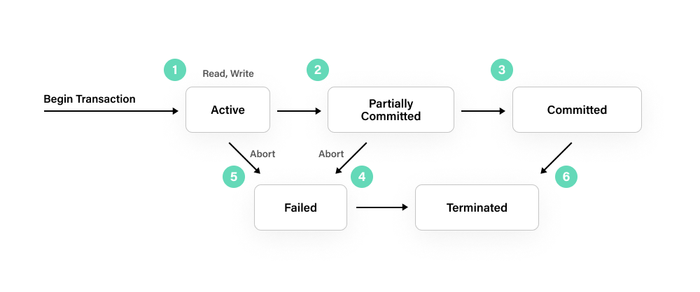

# Django Week 11

## Database SQL – Transaction

[source](https://fauna.com/blog/database-transaction)

> a database transaction is a sequence of multiple operations performed on a database, and all served as a single logical unit of work — taking place wholly or not at all. 

เพื่อให้เข้าใจความสำคัญของ transaction มากขึ้น ผมขอยกตัวอย่างง่ายๆ สมมติเราจะโอนเงินระหว่าง Account A และ Account B ขั้นตอนจะเป็นดังนี้

1. Create record ในฐานข้อมูลสำหรับการโอนเงิน 100 บาทจาก Account A ไปยัง Account B
2. อ่านข้อมูล balance ของ Account A
3. หักลบเงิน 100 บาทจาก balance ของ Account A
4. อ่านข้อมูล balance ของ Account B
5. เพิ่มเงิน 100 บาทไปที่ balance ของ Account B

ลองนึกภาพว่าไฟดับหลังจากขั้นตอนที่ 3 จะเกิดอะไรขึ้น?

[source](https://saixiii.com/database-sql-transaction/#google_vignette)

### How do database transactions work?

เราลองมาดูว่า life cycle ของ database transaction จะมีสถานะ (state) อะไรบ้าง

1. **Active states:** It is the first state during the execution of a transaction. A transaction is active as long as its instructions (read or write operations) are performed.
2. **Partially committed:** A change has been executed in this state, but the database has not yet committed the change on disk. In this state, data is stored in the memory buffer, and the buffer is not yet written to disk.
3. **Committed:** In this state, all the transaction updates are permanently stored in the database. Therefore, it is not possible to rollback the transaction after this point.
4. **Failed:** If a transaction fails or has been aborted in the active state or partially committed state, it enters into a failed state.
5. **Terminated state:** This is the last and final transaction state after a committed or aborted state. This marks the end of the database transaction life cycle.

### What are ACID properties, and why are they important?

Transaction จะต้องมีคุณสมบัติตามหลักการ ACID 4 อย่างดังนี้

- **Atomicity** − คือ การที่แต่ละ transacion ต้อง “all or nothing”  หมายถึง ถ้ามีกระบวนการใดหรือส่วนหนึ่งส่วนใด fail ทั้งหมดของ transaction นั้นมีค่าเป็น fail และ database จะยกเลิกการเปลี่ยนแปลงที่เกิดจาก transaction นั้น
- **Consistency** − คือคุณสมบัตที่จะต้องแน่ใจได้ว่า ไม่ว่า transaction จะทำถึงกระบวนการไหน ข้อมูลจะต้องถูกเขียนลงบน database อย่างถูกต้องตามกฎที่ตั้งไว้
- **Isolation** − คือสำหรับกรณี multiple concurrent transactions ทำงานพร้อมกัน แต่ละ transaction จะต้องไม่ขึ้นต่อกัน และสามารถทำงานได้โดยไม่มีผลกระทบต่อ transaction อื่น
- **Durability** − คือ คุณสมบัติที่เมื่อใดก็ตามที่ transaction มีการ “committed” ข้อมูล transaction นั้นจะต้องยังคงอยู่ครบถ้วน ถึงแม้จะเกิดไฟดับ หรือ ระบบล่มหลังจากนั้น

### Transaction control

คำสั่งที่ทำ Transaction control จะใช้งานเฉพาะกับ SQL DML Command เช่น INSERT, UPDATE และ DELETE เท่านั้น

- COMMIT − ยืนยันการเปลี่ยนแปลงข้อมูล
- ROLLBACK − ดึงข้อมูลเก่าก่อนหน้ากลับมา จากจุด savepoint
- SAVEPOINT − กำหนดจุดของข้อมูล ที่ให้ rollback ข้อมูลกลับมา
